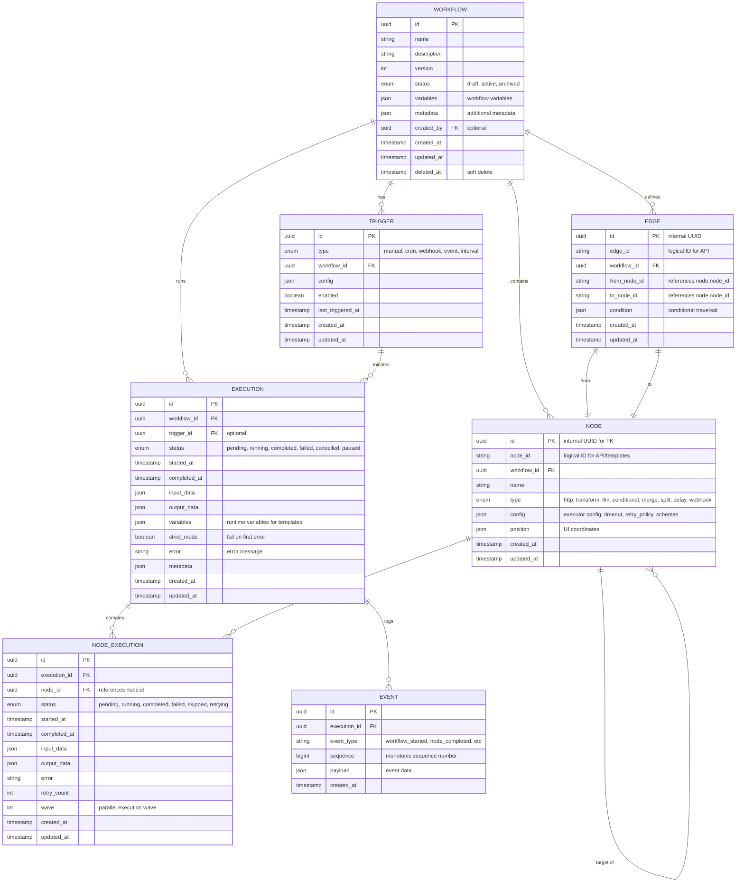
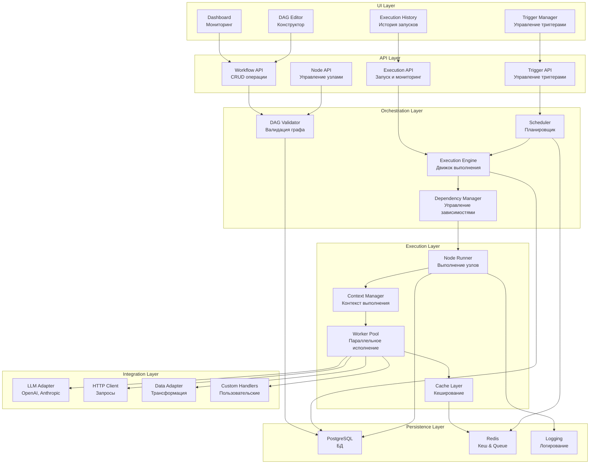
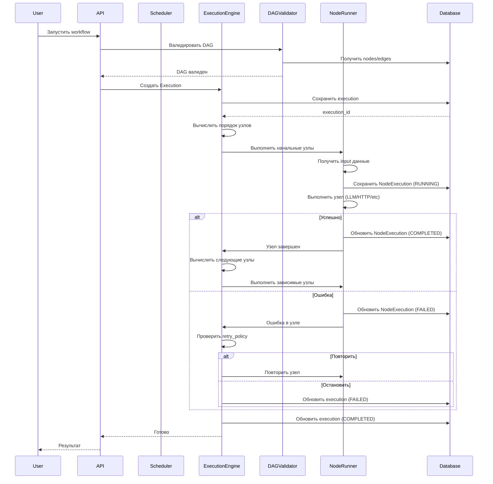
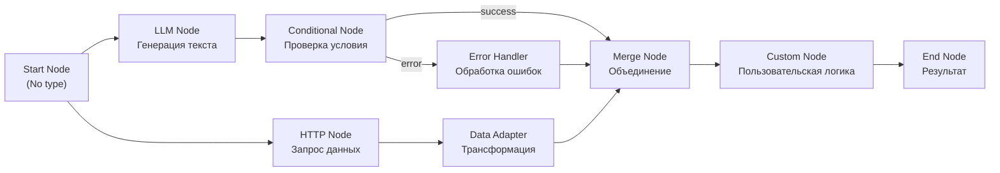
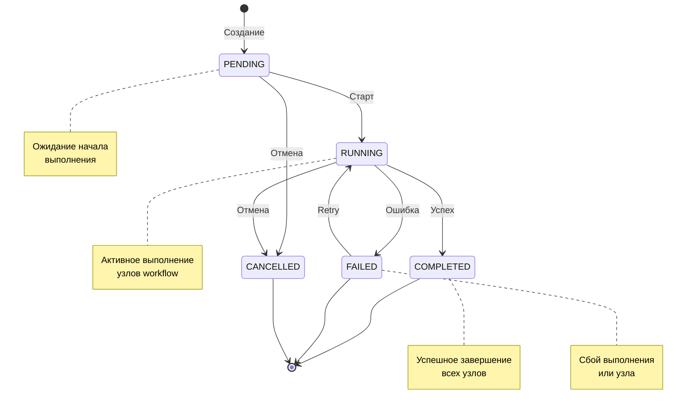
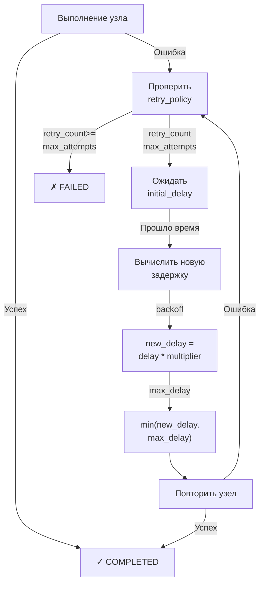

# Диаграммы и архитектура

## ER диаграмма сущностей

## Архитектура системы

## Жизненный цикл выполнения workflow

## Типы узлов и их взаимодействие

## Состояния выполнения

## Обработка ошибок и повторы

