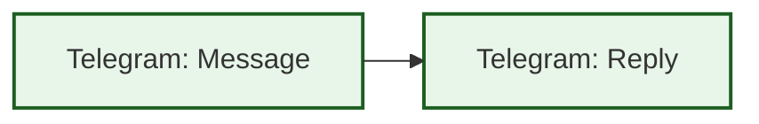
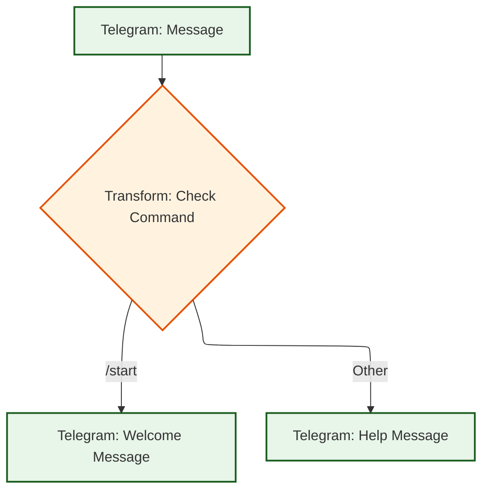
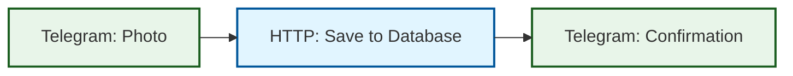
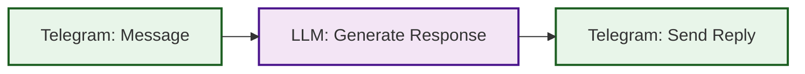

# Telegram Webhook Trigger

## Обзор

Telegram Webhook Trigger позволяет запускать workflow при получении обновлений от Telegram Bot API. Это эффективный способ автоматизации ответов на сообщения, команды, кнопки и другие события в Telegram.

## Возможности

- **Автоматическая обработка сообщений** от пользователей
- **Поддержка всех типов обновлений** Telegram API
- **Валидация безопасности** через secret_token
- **Парсинг медиа-файлов** (фото, документы, аудио, видео)
- **Обработка callback кнопок** и inline запросов
- **Извлечение данных пользователей** и чатов

## Настройка Telegram Bot

### 1. Создание бота

1. Откройте Telegram и найдите бота [@BotFather](https://t.me/botfather)
2. Отправьте команду `/newbot`
3. Следуйте инструкциям для создания бота
4. Сохраните полученный **Bot Token** (формат: `123456789:ABCdefGHIjklMNOpqrsTUVwxyz`)

### 2. Настройка webhook в Telegram

После создания триггера в MBFlow, вам нужно настроить webhook в Telegram Bot API:

```bash
# Замените <BOT_TOKEN> на ваш токен бота
# Замените <TRIGGER_ID> на ID созданного триггера
# Замените <YOUR_DOMAIN> на ваш домен

curl -X POST "https://api.telegram.org/bot<BOT_TOKEN>/setWebhook" \
  -H "Content-Type: application/json" \
  -d '{
    "url": "https://<YOUR_DOMAIN>/api/v1/webhooks/telegram/<TRIGGER_ID>",
    "secret_token": "your_secret_token_here"
  }'
```

**Важно:** Telegram требует HTTPS для webhook'ов. Убедитесь, что ваш MBFlow сервер доступен по HTTPS.

## Создание Webhook Trigger

### Через REST API

```bash
POST /api/v1/triggers
Content-Type: application/json

{
  "workflow_id": "your-workflow-id",
  "name": "Telegram Bot Webhook",
  "description": "Handle Telegram bot updates",
  "type": "webhook",
  "enabled": true,
  "config": {
    "secret_token": "your_secret_token_here",
    "input": {
      "bot_token": "{{env.telegram_bot_token}}"
    }
  }
}
```

### Через SDK

```go
package main

import (
    "context"
    "github.com/smilemakc/mbflow/pkg/sdk"
    "github.com/smilemakc/mbflow/pkg/models"
)

func main() {
    client, _ := sdk.NewClient(sdk.WithHTTPEndpoint("http://localhost:8181"))

    trigger, err := client.Triggers().Create(context.Background(), &models.Trigger{
        WorkflowID: "your-workflow-id",
        Name: "Telegram Bot Webhook",
        Type: models.TriggerTypeWebhook,
        Enabled: true,
        Config: map[string]interface{}{
            "secret_token": "your_secret_token_here",
        },
    })

    if err != nil {
        panic(err)
    }

    // Webhook URL: https://your-domain.com/api/v1/webhooks/telegram/<trigger.ID>
}
```

## Структура входных данных

Telegram webhook передает в workflow следующие данные:

### Базовые поля

```json
{
  "update_id": 123456789,
  "update_type": "message",
  "text": "Hello, bot!",
  "chat_id": 123456789,
  "user_id": 987654321,
  "username": "john_doe",
  "first_name": "John"
}
```

### Полная структура сообщения

```json
{
  "update_id": 123456789,
  "update_type": "message",
  "message": {
    "message_id": 42,
    "date": 1234567890,
    "chat": {
      "id": 123456789,
      "type": "private",
      "title": "Chat Title"
    },
    "from": {
      "id": 987654321,
      "is_bot": false,
      "first_name": "John",
      "last_name": "Doe",
      "username": "john_doe"
    },
    "text": "Hello, bot!"
  }
}
```

## Типы обновлений

### 1. Текстовое сообщение

```json
{
  "update_type": "message",
  "message": {
    "text": "Hello, bot!",
    "from": {...},
    "chat": {...}
  }
}
```

### 2. Фото

```json
{
  "update_type": "message",
  "message": {
    "photo": [
      {
        "file_id": "AgACAgIAAxkBAAIC...",
        "file_unique_id": "AQADAgAD...",
        "width": 1280,
        "height": 720,
        "file_size": 123456
      }
    ],
    "caption": "Check this out!"
  }
}
```

### 3. Документ

```json
{
  "update_type": "message",
  "message": {
    "document": {
      "file_id": "BQACAgIAAxkBAAID...",
      "file_unique_id": "UniqueDocID",
      "file_name": "report.pdf",
      "mime_type": "application/pdf",
      "file_size": 654321
    }
  }
}
```

### 4. Callback Query (кнопки)

```json
{
  "update_type": "callback_query",
  "callback_query": {
    "id": "callback_id",
    "data": "button_action",
    "from": {...},
    "message": {...}
  }
}
```

### 5. Inline Query

```json
{
  "update_type": "inline_query",
  "inline_query": {
    "id": "query_id",
    "query": "search term",
    "from": {...},
    "offset": "0"
  }
}
```

## Примеры использования

### Пример 1: Эхо-бот



```json
{
  "nodes": [
    {
      "id": "reply",
      "type": "telegram",
      "config": {
        "bot_token": "{{env.telegram_bot_token}}",
        "chat_id": "{{input.chat_id}}",
        "message_type": "text",
        "text": "You said: {{input.text}}"
      }
    }
  ]
}
```

### Пример 2: Обработка команды /start



```json
{
  "nodes": [
    {
      "id": "check_command",
      "type": "transform",
      "config": {
        "type": "expression",
        "expression": "{'is_start': input.text == '/start'}"
      }
    },
    {
      "id": "welcome",
      "type": "telegram",
      "config": {
        "bot_token": "{{env.telegram_bot_token}}",
        "chat_id": "{{input.chat_id}}",
        "message_type": "text",
        "text": "Welcome, {{input.first_name}}! 👋\n\nI'm here to help you.",
        "parse_mode": "Markdown"
      },
      "condition": "{{check_command.is_start}}"
    },
    {
      "id": "help",
      "type": "telegram",
      "config": {
        "bot_token": "{{env.telegram_bot_token}}",
        "chat_id": "{{input.chat_id}}",
        "message_type": "text",
        "text": "Try /start command",
        "parse_mode": "Markdown"
      },
      "condition": "{{!check_command.is_start}}"
    }
  ],
  "edges": [
    {"from": "check_command", "to": "welcome"},
    {"from": "check_command", "to": "help"}
  ]
}
```

### Пример 3: Сохранение фото в базу данных



```json
{
  "nodes": [
    {
      "id": "check_photo",
      "type": "transform",
      "config": {
        "type": "expression",
        "expression": "{'has_photo': 'photo' in input.message, 'file_id': input.message.photo[-1].file_id if 'photo' in input.message else ''}"
      }
    },
    {
      "id": "save_photo",
      "type": "http",
      "config": {
        "method": "POST",
        "url": "https://api.example.com/photos",
        "body": {
          "user_id": "{{input.user_id}}",
          "file_id": "{{check_photo.file_id}}",
          "caption": "{{input.message.caption}}"
        }
      },
      "condition": "{{check_photo.has_photo}}"
    },
    {
      "id": "confirm",
      "type": "telegram",
      "config": {
        "bot_token": "{{env.telegram_bot_token}}",
        "chat_id": "{{input.chat_id}}",
        "message_type": "text",
        "text": "Photo saved! ID: {{save_photo.body.id}}"
      },
      "condition": "{{check_photo.has_photo}}"
    }
  ],
  "edges": [
    {"from": "check_photo", "to": "save_photo"},
    {"from": "save_photo", "to": "confirm"}
  ]
}
```

### Пример 4: AI-бот с LLM



```json
{
  "nodes": [
    {
      "id": "generate_response",
      "type": "llm",
      "config": {
        "provider": "anthropic",
        "model": "claude-3-sonnet-20240229",
        "api_key": "{{env.anthropic_api_key}}",
        "messages": [
          {
            "role": "system",
            "content": "You are a helpful assistant in Telegram. Be concise and friendly."
          },
          {
            "role": "user",
            "content": "{{input.text}}"
          }
        ],
        "max_tokens": 500
      }
    },
    {
      "id": "reply",
      "type": "telegram",
      "config": {
        "bot_token": "{{env.telegram_bot_token}}",
        "chat_id": "{{input.chat_id}}",
        "message_type": "text",
        "text": "{{generate_response.content}}"
      }
    }
  ],
  "edges": [
    {"from": "generate_response", "to": "reply"}
  ]
}
```

### Пример 5: Обработка callback кнопок

```json
{
  "nodes": [
    {
      "id": "parse_callback",
      "type": "transform",
      "config": {
        "type": "expression",
        "expression": "{'action': input.callback_query.data, 'user_id': input.callback_query.from.id}"
      }
    },
    {
      "id": "handle_like",
      "type": "http",
      "config": {
        "method": "POST",
        "url": "https://api.example.com/likes",
        "body": {
          "user_id": "{{parse_callback.user_id}}"
        }
      },
      "condition": "{{parse_callback.action == 'like'}}"
    },
    {
      "id": "send_confirmation",
      "type": "telegram",
      "config": {
        "bot_token": "{{env.telegram_bot_token}}",
        "chat_id": "{{input.callback_query.from.id}}",
        "message_type": "text",
        "text": "Thanks for your feedback!"
      }
    }
  ],
  "edges": [
    {"from": "parse_callback", "to": "handle_like"},
    {"from": "handle_like", "to": "send_confirmation"}
  ]
}
```

## Безопасность

### Secret Token

Настоятельно рекомендуется использовать `secret_token` для валидации webhook запросов:

1. **Генерация токена:**
```bash
# Сгенерируйте случайный токен
openssl rand -hex 32
```

2. **Настройка в trigger:**
```json
{
  "config": {
    "secret_token": "your_generated_token_here"
  }
}
```

3. **Настройка в Telegram:**
```bash
curl -X POST "https://api.telegram.org/bot<BOT_TOKEN>/setWebhook" \
  -H "Content-Type: application/json" \
  -d '{
    "url": "https://your-domain.com/api/v1/webhooks/telegram/<TRIGGER_ID>",
    "secret_token": "your_generated_token_here"
  }'
```

Telegram будет отправлять токен в заголовке `X-Telegram-Bot-Api-Secret-Token`, и MBFlow автоматически проверит его.

### IP Whitelist

Вы также можете ограничить доступ по IP адресам Telegram серверов:

```json
{
  "config": {
    "ip_whitelist": [
      "149.154.160.0/20",
      "91.108.4.0/22"
    ]
  }
}
```

Актуальный список IP адресов Telegram: https://core.telegram.org/bots/webhooks#the-short-version

## Rate Limiting

По умолчанию применяется rate limit **100 запросов в минуту** на один trigger. Это защищает от злоупотреблений и DDoS атак.

## Отладка

### Проверка webhook статуса

```bash
curl -X GET "https://api.telegram.org/bot<BOT_TOKEN>/getWebhookInfo"
```

Ответ покажет:
- Текущий webhook URL
- Последние ошибки
- Количество pending updates

### Просмотр логов

Все webhook запросы логируются в MBFlow:

```bash
# Просмотр логов сервера
docker logs mbflow-api -f --tail 100
```

### Тестирование локально

Для локальной разработки используйте ngrok или другой туннель:

```bash
# Запустите ngrok
ngrok http 8181

# Используйте HTTPS URL от ngrok для webhook
curl -X POST "https://api.telegram.org/bot<BOT_TOKEN>/setWebhook" \
  -d "url=https://your-ngrok-url.ngrok.io/api/v1/webhooks/telegram/<TRIGGER_ID>"
```

## Ограничения Telegram API

- **Максимум 30 сообщений в секунду** для одного бота
- **Максимум 20 сообщений в минуту** для одного чата
- **Текст сообщения**: до 4096 символов
- **Caption**: до 1024 символов
- **Размер файлов**: до 50 МБ

## Полезные ссылки

- [Telegram Bot API Documentation](https://core.telegram.org/bots/api)
- [Webhook Guide](https://core.telegram.org/bots/webhooks)
- [BotFather Commands](https://core.telegram.org/bots#6-botfather)
- [MBFlow Template Engine](TEMPLATE_ENGINE.md)
- [Telegram Executor](executors/TELEGRAM_EXECUTOR.md)

## Troubleshooting

### Webhook не получает обновления

1. Проверьте webhook статус: `getWebhookInfo`
2. Убедитесь, что URL доступен по HTTPS
3. Проверьте, что trigger включен (`enabled: true`)
4. Проверьте логи MBFlow на ошибки

### Ошибка 401 Unauthorized

- Проверьте, что `secret_token` совпадает в trigger и в Telegram
- Убедитесь, что токен передается в заголовке `X-Telegram-Bot-Api-Secret-Token`

### Ошибка 403 Forbidden

- Trigger может быть отключен
- Проверьте IP whitelist (если настроен)

### Ошибка 429 Too Many Requests

- Превышен rate limit
- Уменьшите частоту запросов или увеличьте лимит в конфигурации trigger

## Best Practices

1. **Используйте secret_token** для всех production ботов
2. **Обрабатывайте ошибки** в workflow с помощью условных переходов
3. **Логируйте важные события** для отладки
4. **Тестируйте локально** с ngrok перед деплоем
5. **Мониторьте rate limits** через метрики MBFlow
6. **Используйте variables** для хранения bot_token и других секретов