# Resources and Billing Architecture

## System Overview

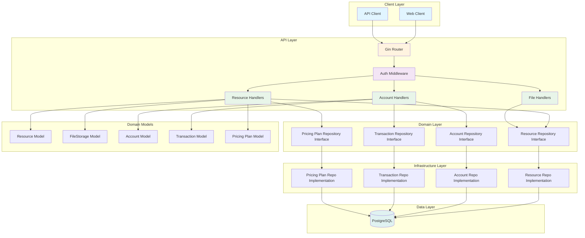

## Request Flow

### Resource Creation Flow

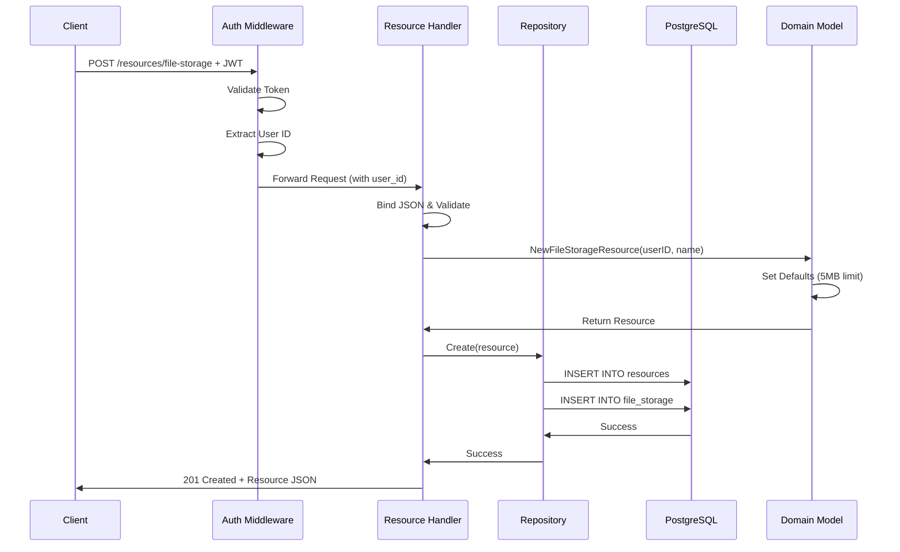

### Deposit Flow with Idempotency

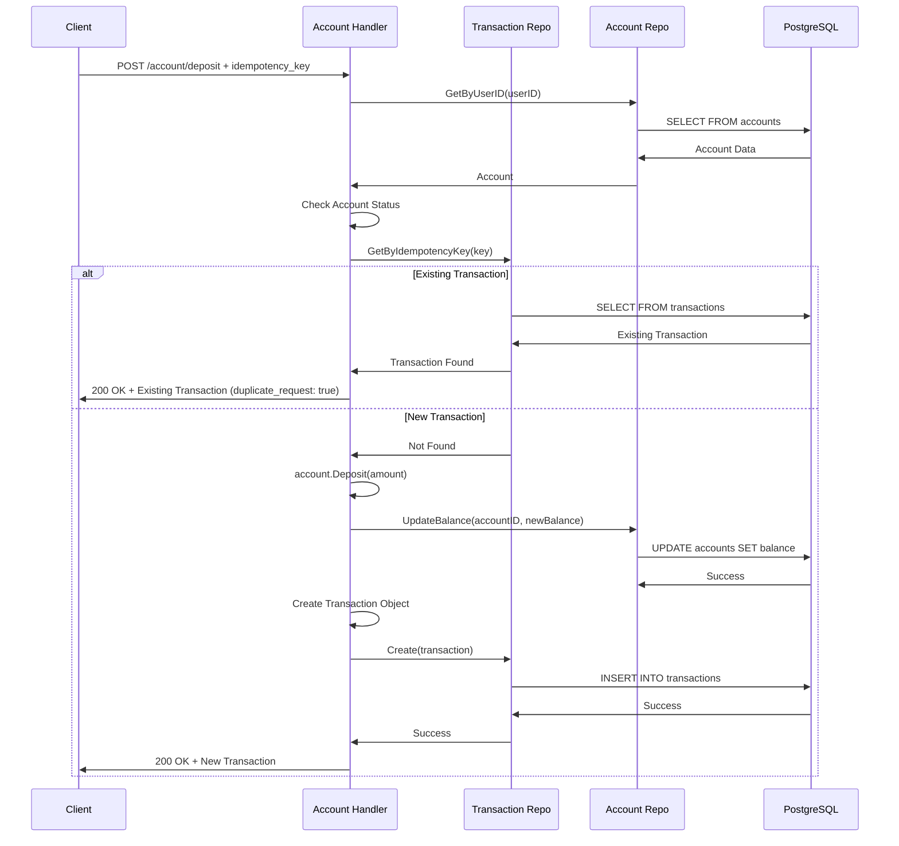

## Data Model

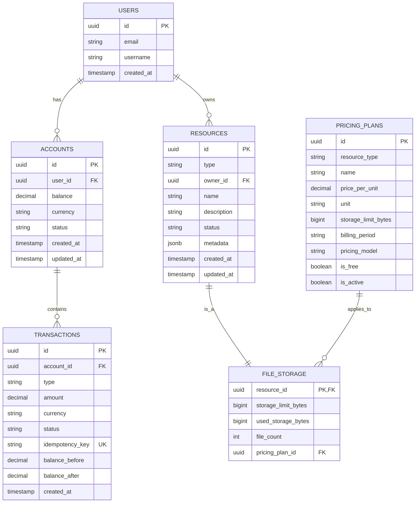

## Component Diagram

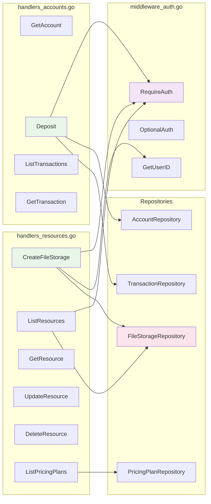

## State Machine: Account Status

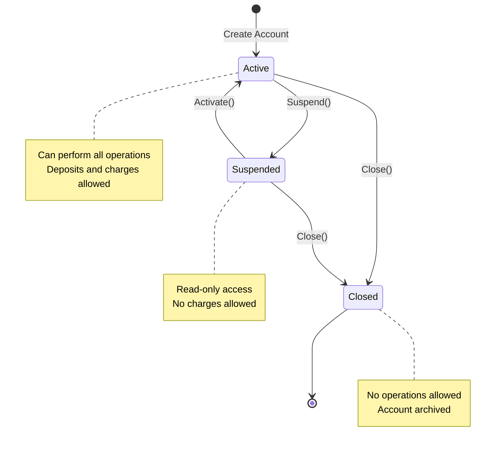

## State Machine: Transaction Status

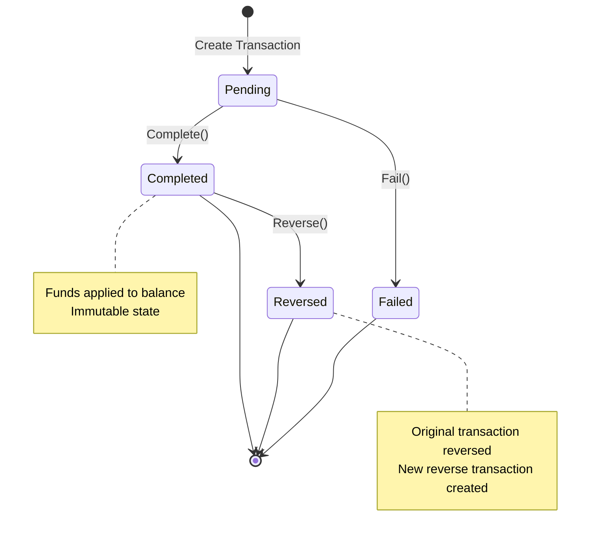

## Resource Usage Flow

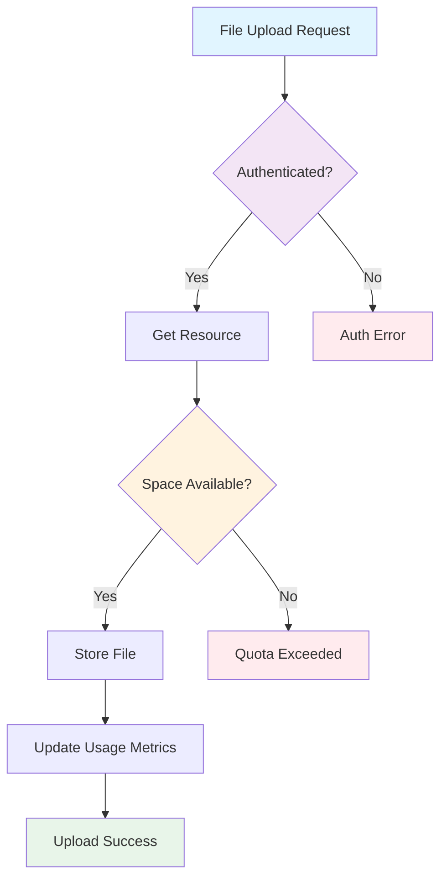

## API Endpoint Hierarchy

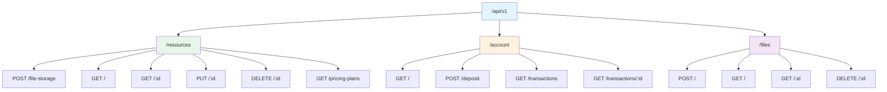

## Security Layers

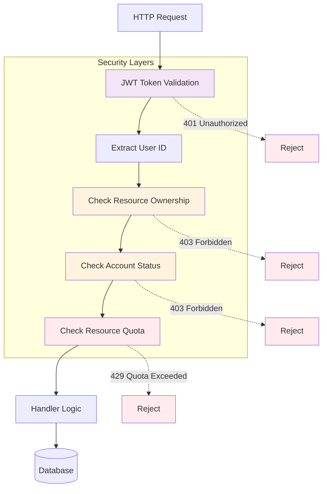

## Performance Considerations

### Caching Strategy

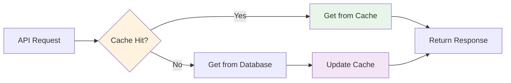

**Cacheable Data:**
- Pricing Plans (rarely change)
- User Resources List (5-minute TTL)
- Account Balance (1-minute TTL)

**Non-Cacheable:**
- Transaction History (real-time data)
- Resource Usage Metrics (frequently updated)

## Error Handling Flow

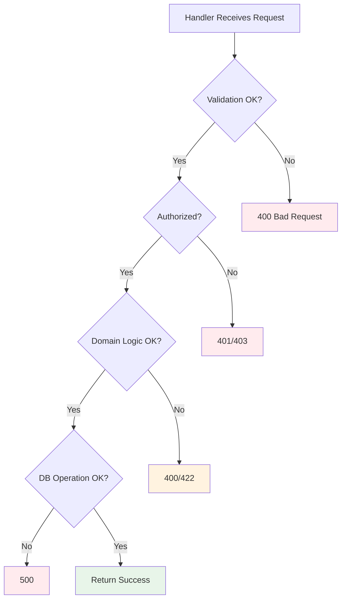

## Deployment Architecture

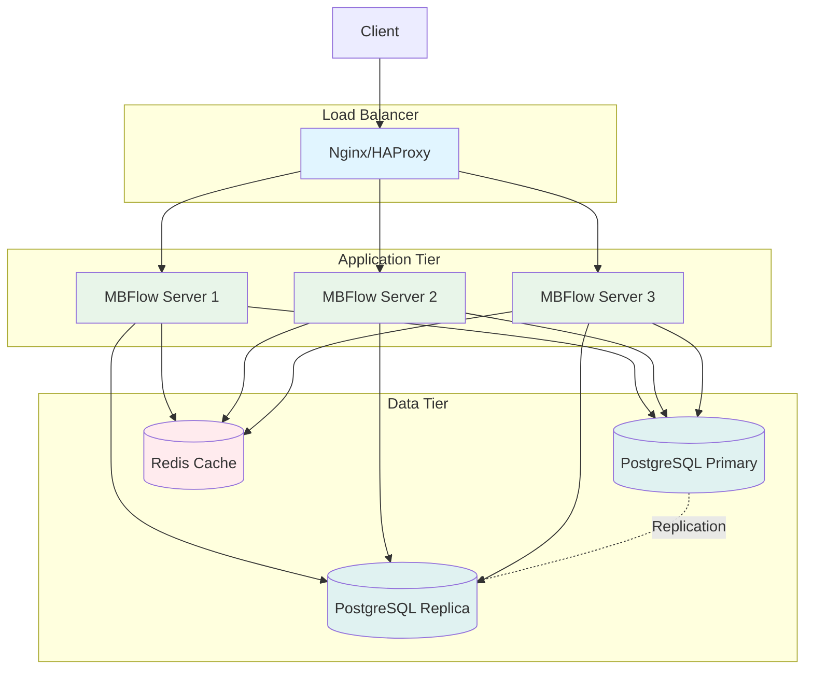
