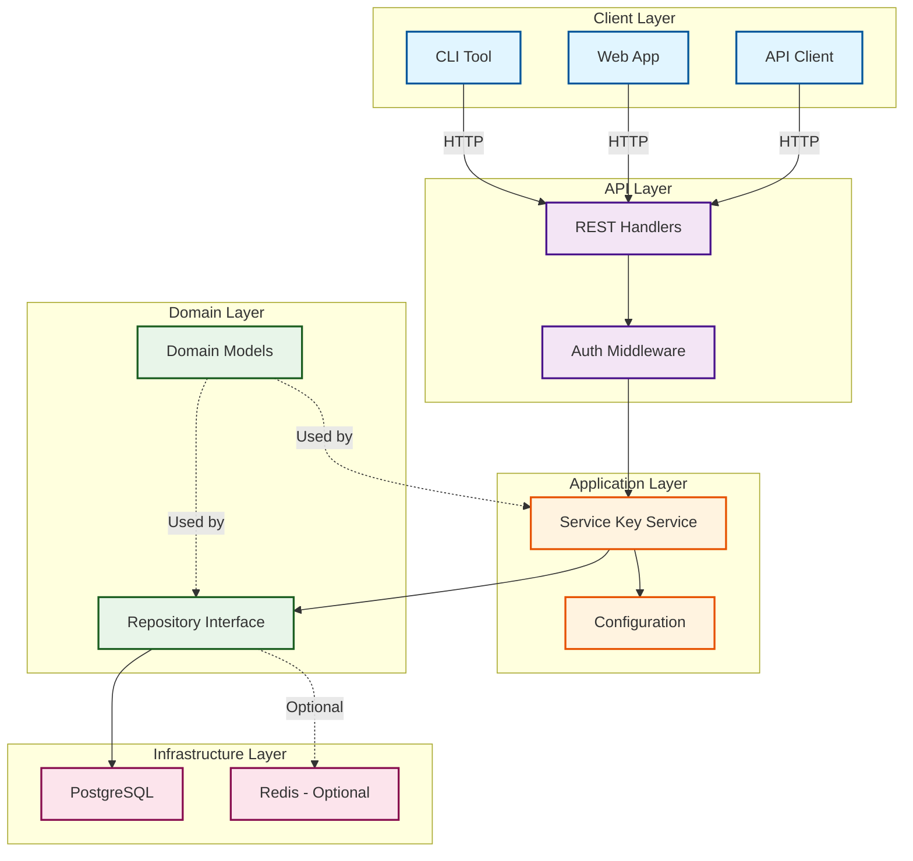
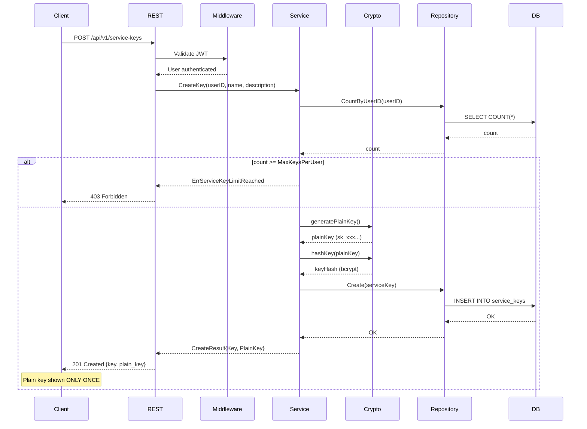
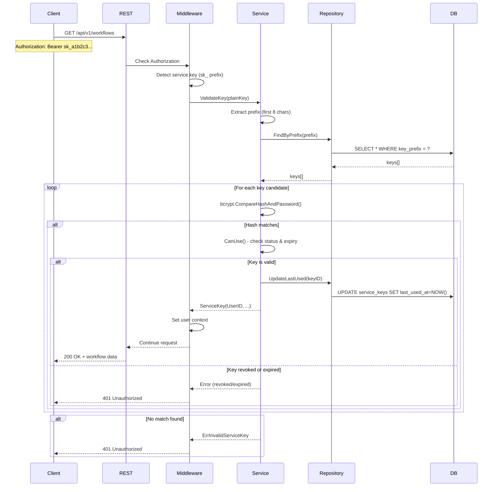
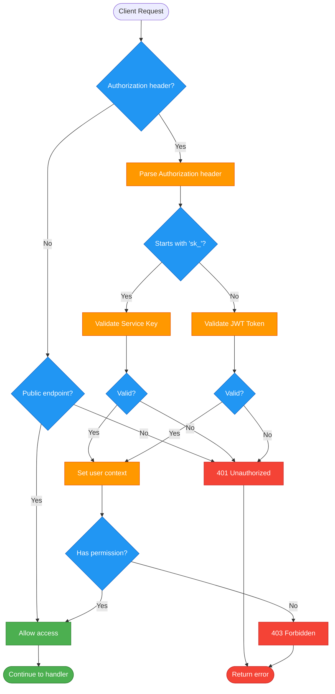
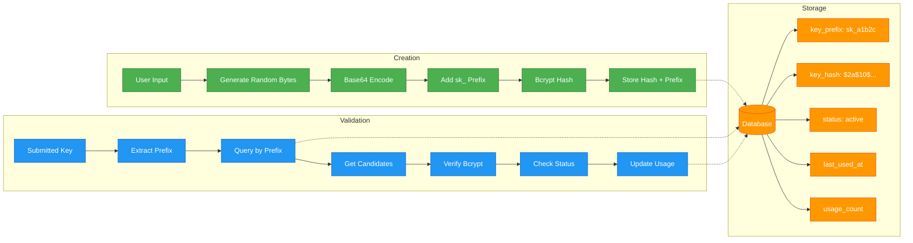
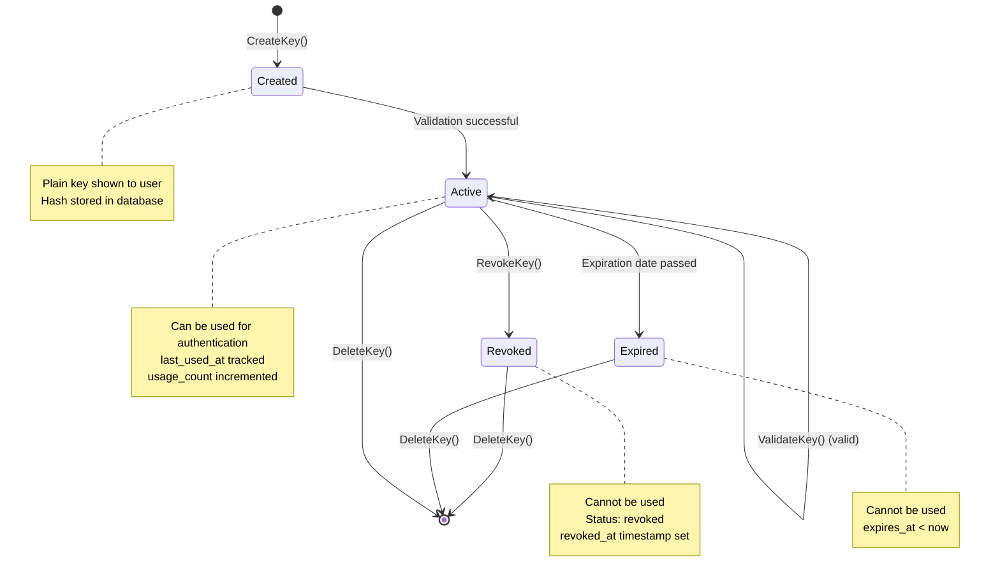
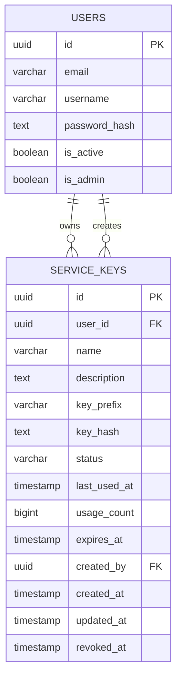
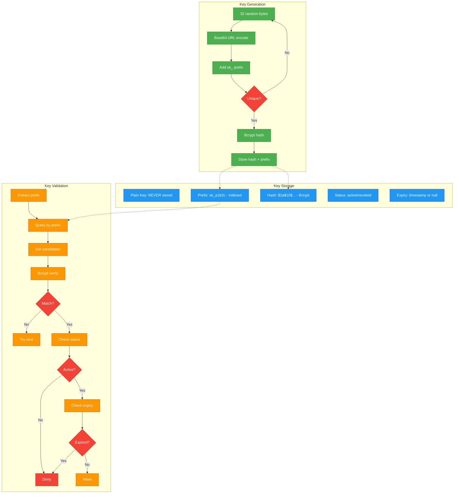
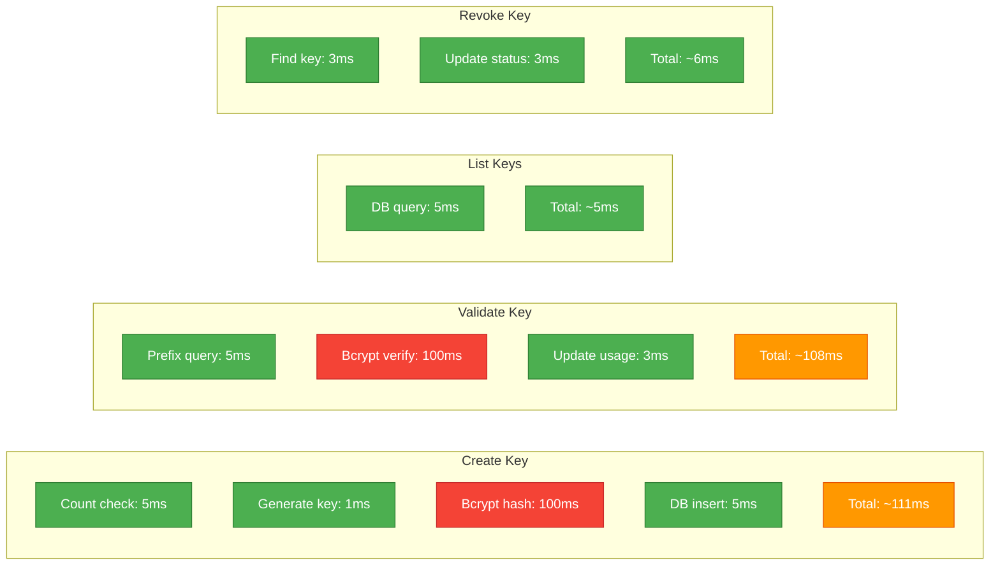
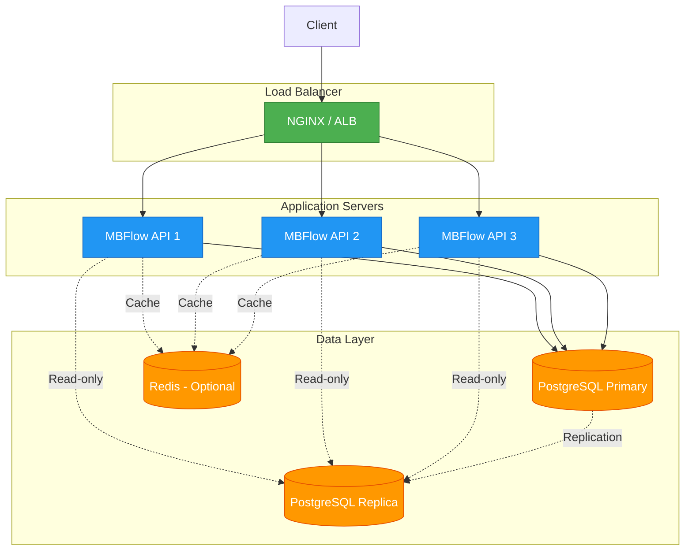

# Service Keys - Architecture Diagrams

## System Architecture



## Key Creation Flow



## Key Validation Flow



## Authentication Flow (JWT vs Service Key)



## Data Flow



## Component Diagram

```mermaid
graph TB
    subgraph "servicekey Package"
        Service[Service]
        Config[Config]
        CreateResult[CreateResult]
    end

    subgraph "models Package"
        ServiceKey[ServiceKey]
        Errors[Error Types]
    end

    subgraph "repository Package"
        Interface[ServiceKeyRepository]
        Filter[ServiceKeyFilter]
    end

    subgraph "storage Package"
        Implementation[ServiceKeyRepositoryImpl]
        Database[(PostgreSQL)]
    end

    subgraph "crypto Package"
        Random[crypto/rand]
        BCrypt[golang.org/x/crypto/bcrypt]
    end

    Service --> Config
    Service --> CreateResult
    Service --> ServiceKey
    Service --> Errors
    Service --> Interface

    Interface <|.. Implementation
    Implementation --> Database
    Implementation --> Filter

    Service --> Random
    Service --> BCrypt

    classDef service fill:#4caf50,stroke:#2e7d32,color:#fff
    classDef domain fill:#2196f3,stroke:#1565c0,color:#fff
    classDef repo fill:#ff9800,stroke:#e65100,color:#fff
    classDef infra fill:#9c27b0,stroke:#6a1b9a,color:#fff
    classDef crypto fill:#f44336,stroke:#c62828,color:#fff

    class Service,Config,CreateResult service
    class ServiceKey,Errors domain
    class Interface,Filter repo
    class Implementation,Database infra
    class Random,BCrypt crypto
```

## State Diagram



## Database Schema



## Security Model



## Performance Characteristics



## Deployment Architecture



## Notes

- All diagrams use Mermaid syntax for easy rendering
- Security is enforced at multiple layers
- Performance optimized with indexed prefix lookups
- Stateless validation allows horizontal scaling
- Optional Redis caching can reduce DB load
