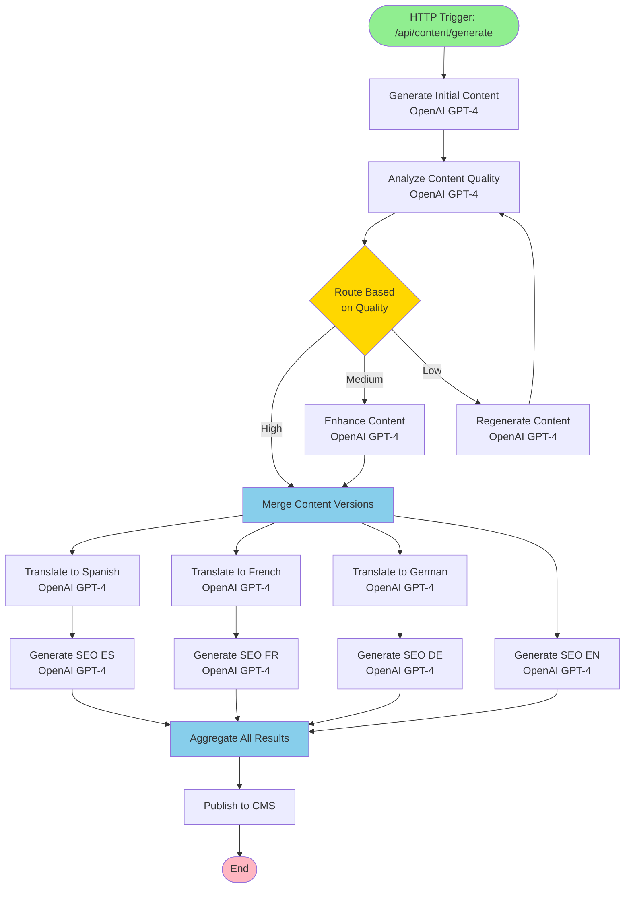
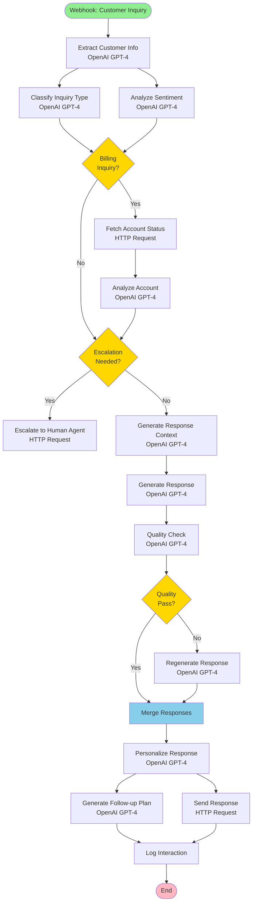
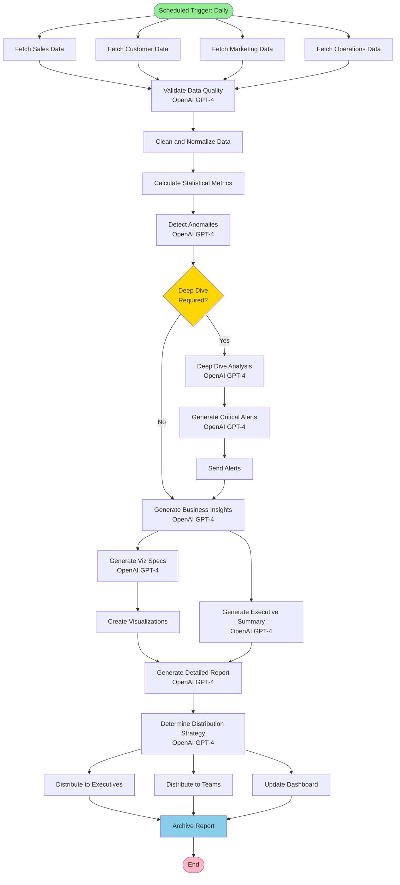
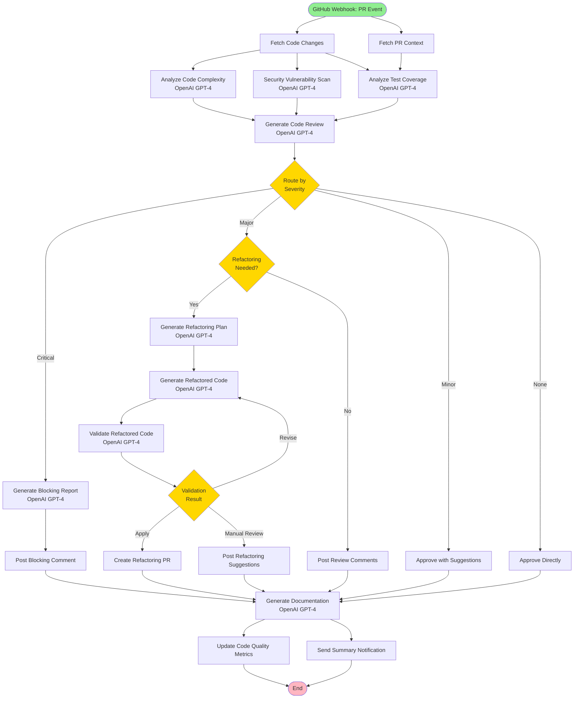
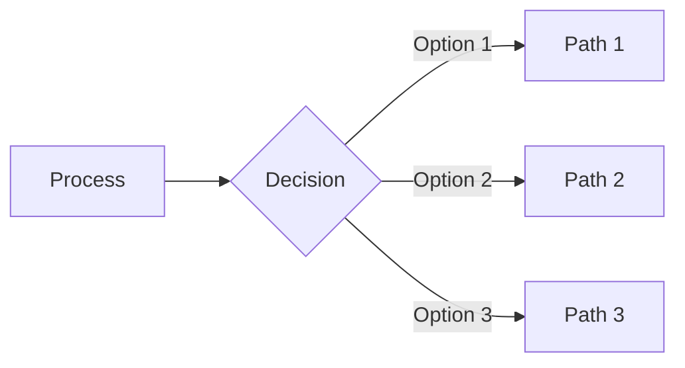
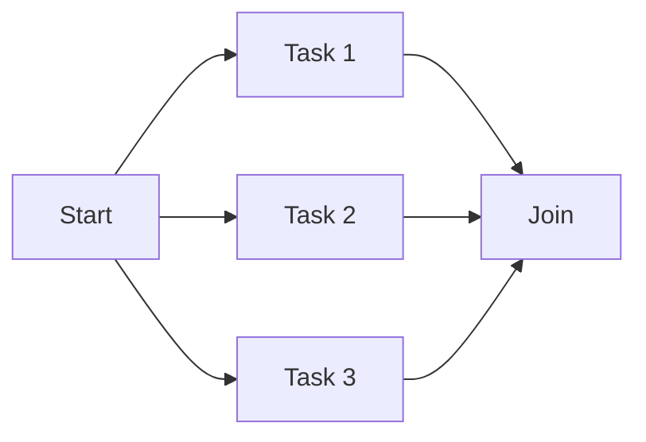
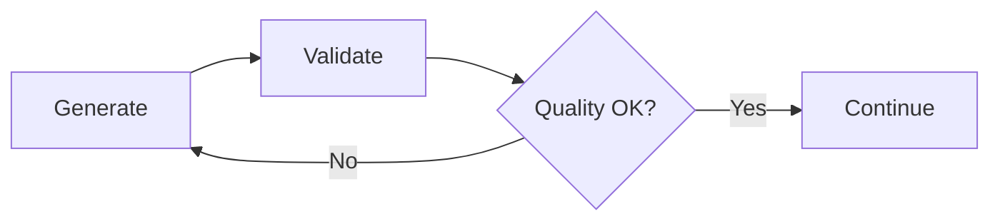
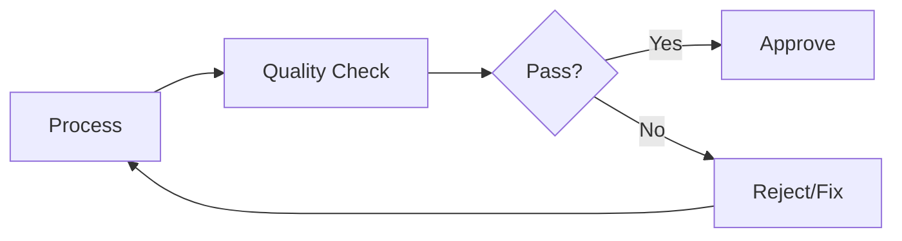

# Workflow Diagrams

Visual representations of the complex workflow examples.

## 1. AI Content Pipeline

## 2. Customer Support AI

## 3. Data Analysis & Reporting

## 4. Code Review & Refactoring

## Legend

- 🟢 **Green (Rounded)**: Start/End nodes (triggers and completion)
- 🟡 **Yellow (Diamond)**: Decision/Router nodes (branching logic)
- 🔵 **Blue (Rectangle)**: Merge/Aggregate nodes (synchronization points)
- ⬜ **White (Rectangle)**: Processing nodes (OpenAI, HTTP, Script execution)

## Key Patterns

### Branching Pattern

### Parallel Processing Pattern

### Feedback Loop Pattern

### Quality Gate Pattern

