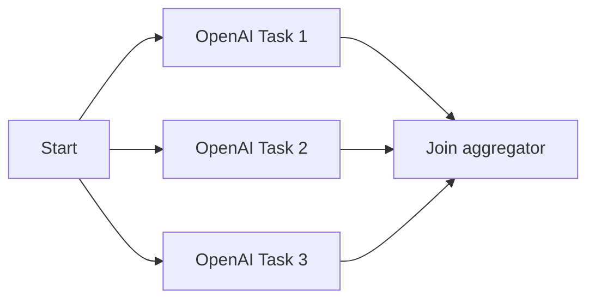

# Parallel Execution Demo

This example demonstrates the parallel processing pattern (fork-join) in the workflow execution engine.

## Overview

The demo shows how multiple nodes can execute in parallel and synchronize at a join node:



## Features

- **Fork Pattern**: Three OpenAI completion nodes execute in parallel
- **Join Pattern**: Results from all parallel tasks are aggregated into a single result
- **Graph-based Execution**: Uses edges to define the workflow structure
- **Performance**: Parallel execution is faster than sequential execution

## Prerequisites

- Go 1.21 or later
- OpenAI API key (set `OPENAI_API_KEY` environment variable)

## Running the Example

```bash
export OPENAI_API_KEY=your-api-key-here
go run examples/parallel-execution-demo/main.go
```

## Workflow Structure

1. **Start Node** (`start`): Prepares initial data with three topics
2. **Parallel Tasks** (`task-1`, `task-2`, `task-3`): 
   - Each task uses OpenAI to generate a summary about a different topic
   - All three tasks execute simultaneously
3. **Join Node** (`join`): Aggregates results from all three parallel tasks

## Expected Output

The example will:
- Execute three OpenAI API calls in parallel
- Display the execution duration (should be faster than sequential execution)
- Show aggregated results from all tasks
- Display execution metrics including AI API usage

## Key Concepts

- **Edges**: Define the workflow graph structure
- **Parallel Execution**: Nodes with the same parent execute concurrently
- **Join Synchronization**: Join nodes wait for all dependencies to complete
- **Error Handling**: By default, execution stops if any parallel branch fails

