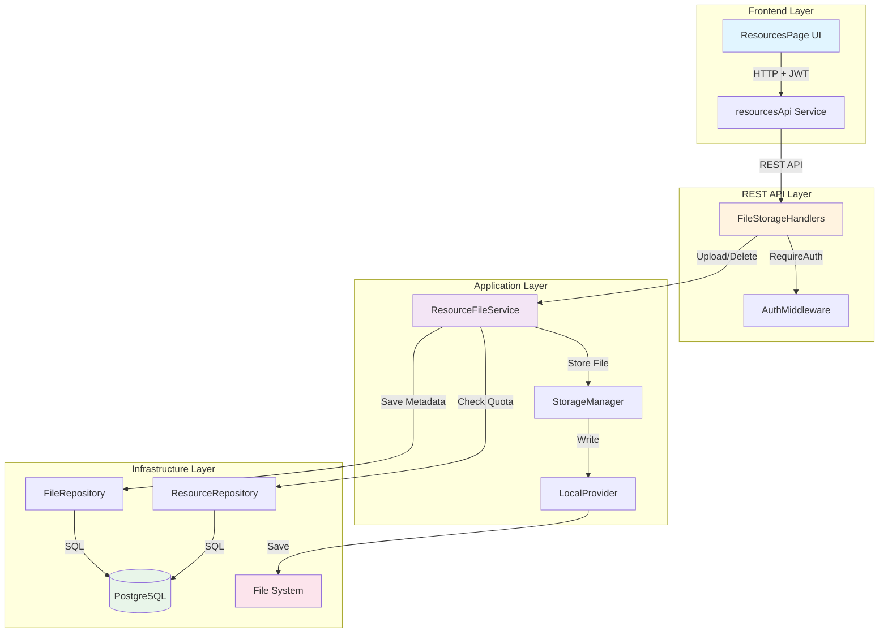
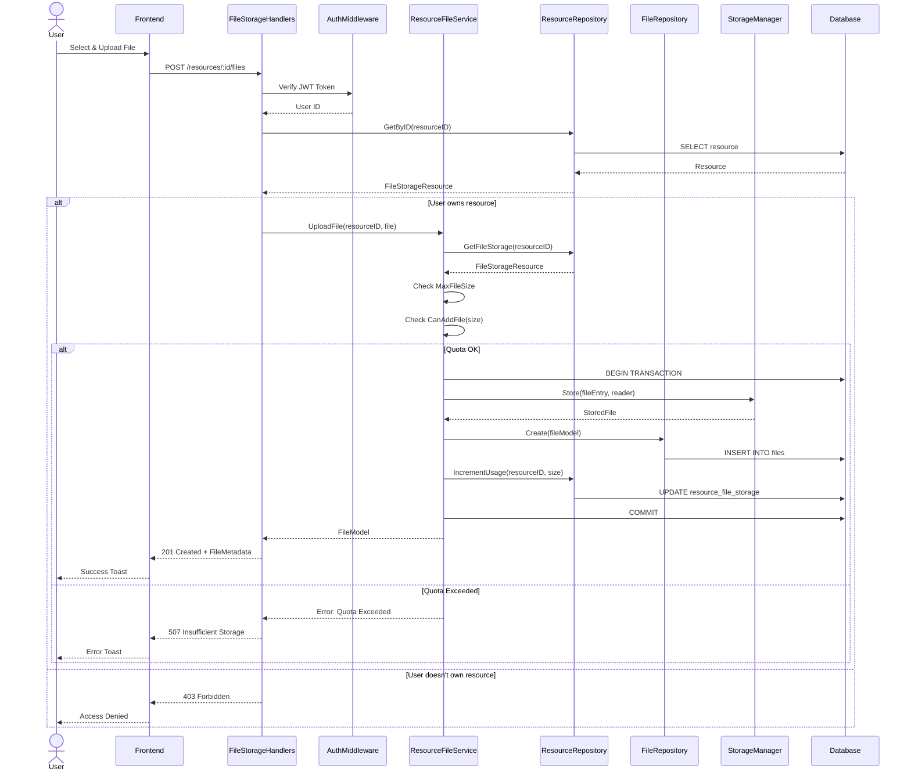
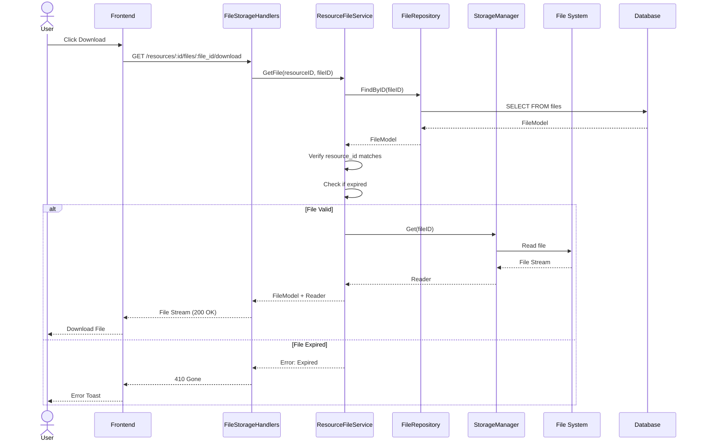
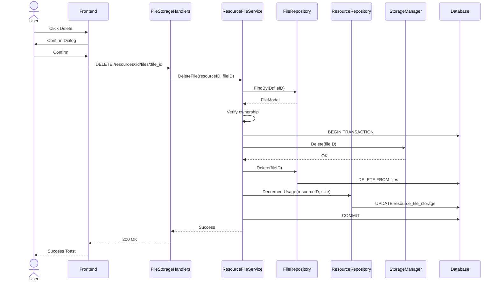
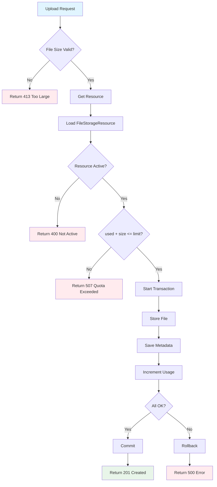
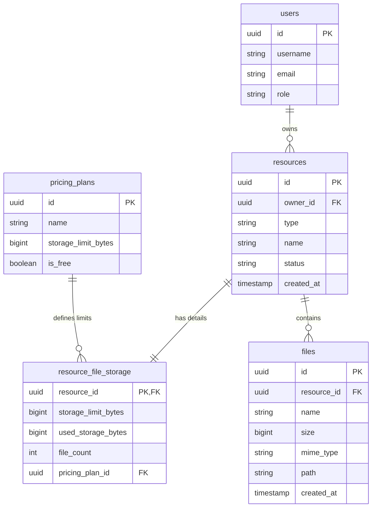
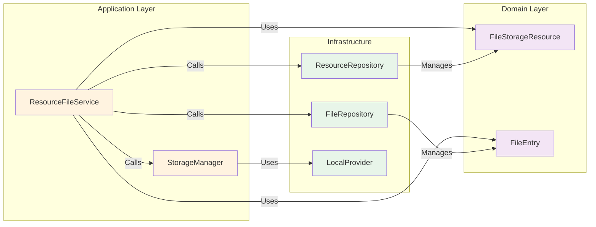
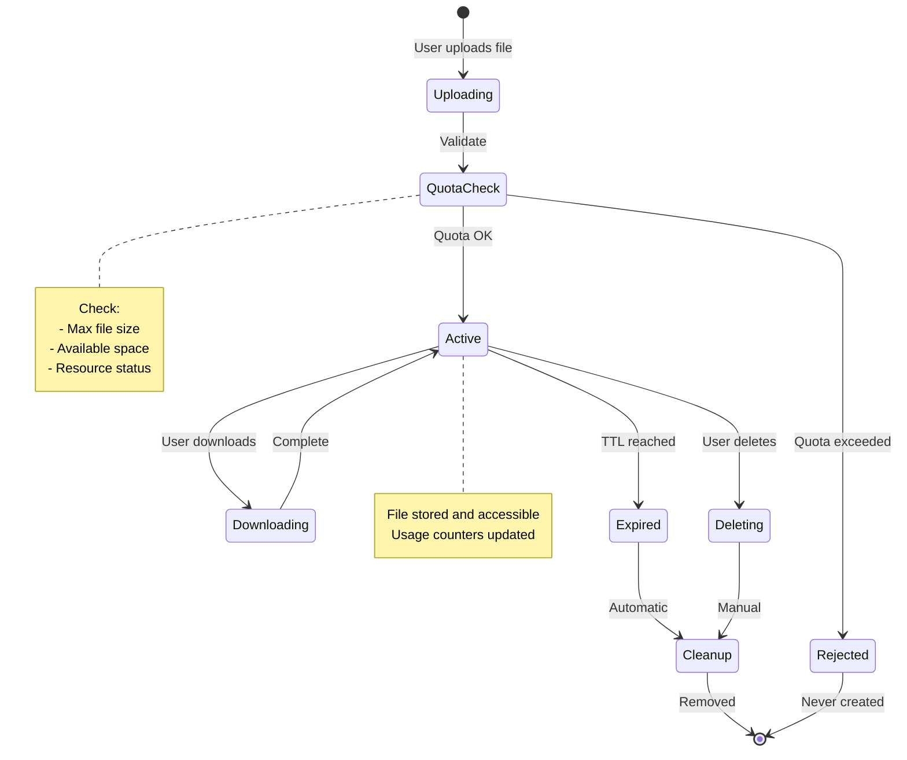
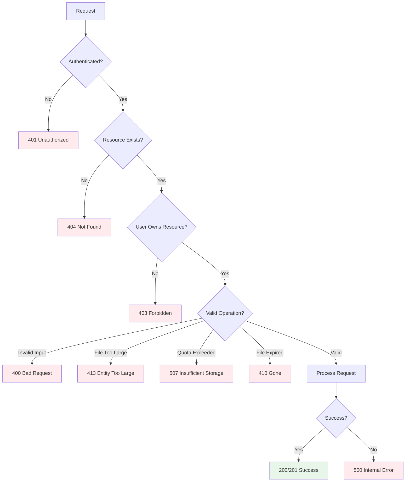

# File Storage Architecture Diagrams

## System Architecture

## Upload File Flow

## Download File Flow

## Delete File Flow

## Quota Check Logic

## Database Schema Relations

## Component Interaction

## State Machine - File Lifecycle

## Error Handling Flow

