# Service API - Architecture Diagrams

## System Architecture

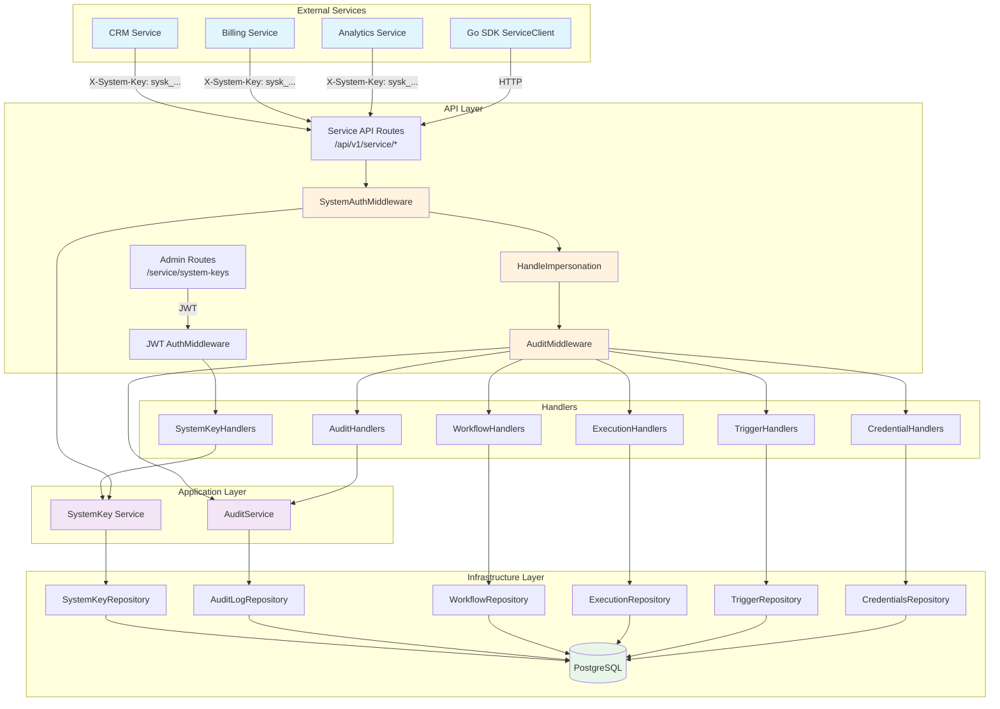

## Authentication Flow (JWT vs Service Key vs System Key)

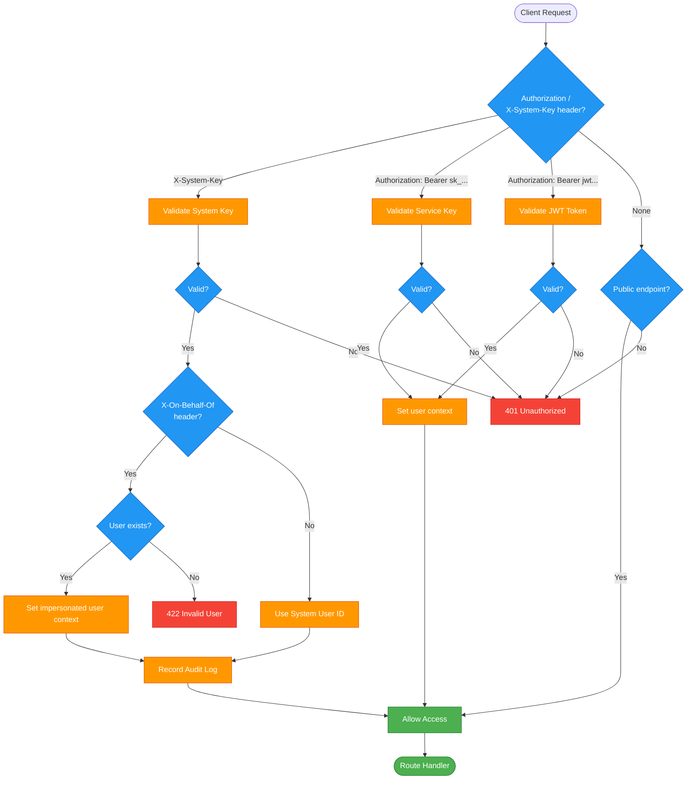

## System Key Creation Flow

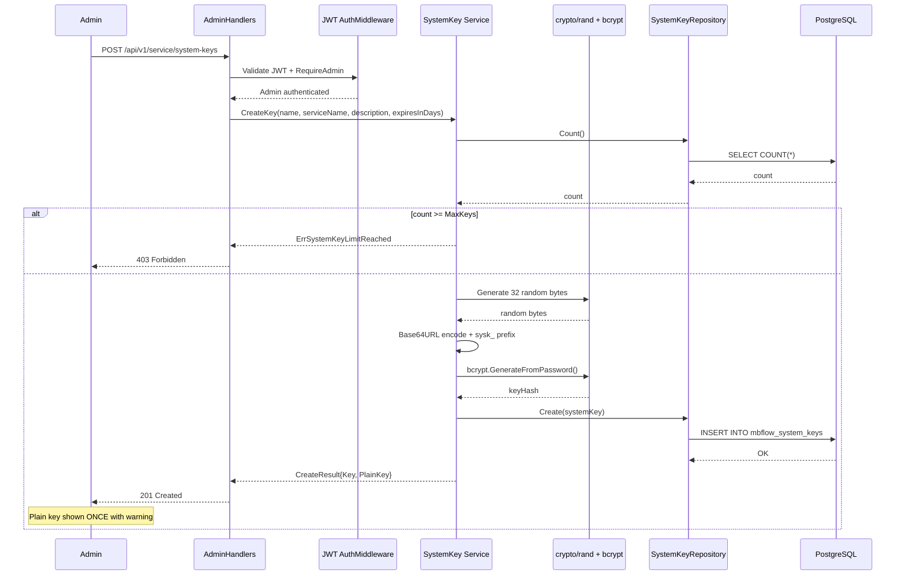

## Service API Request Flow

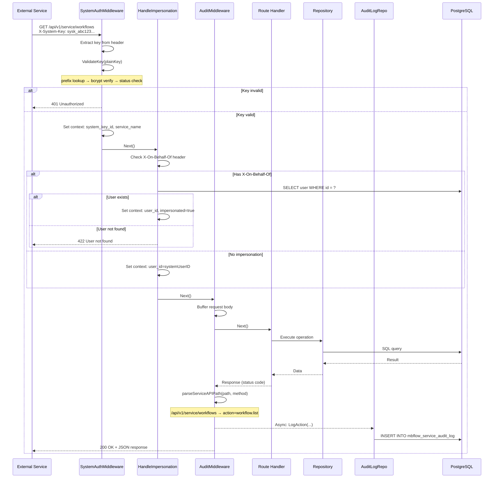

## Impersonation Model

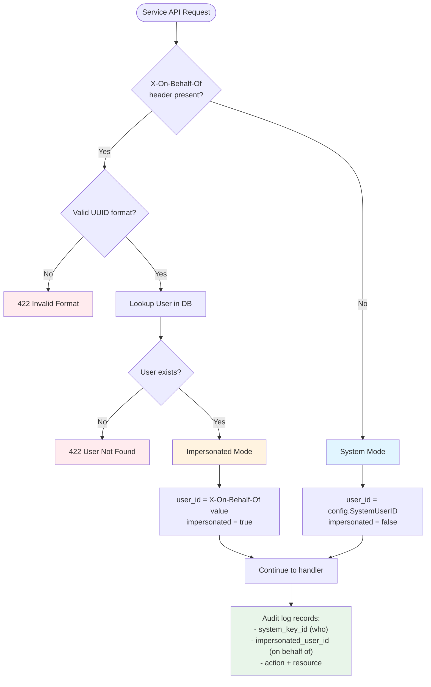

## Audit Log Pipeline

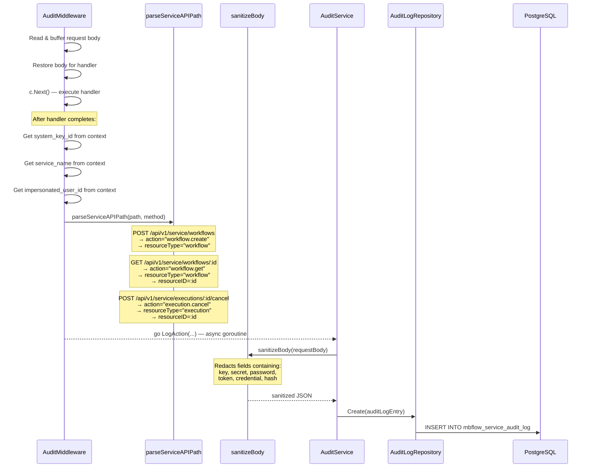

## Database Schema

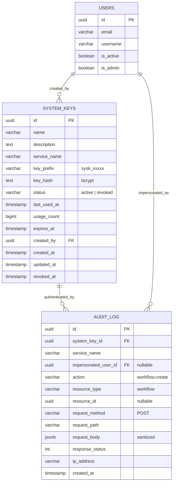

## API Endpoints

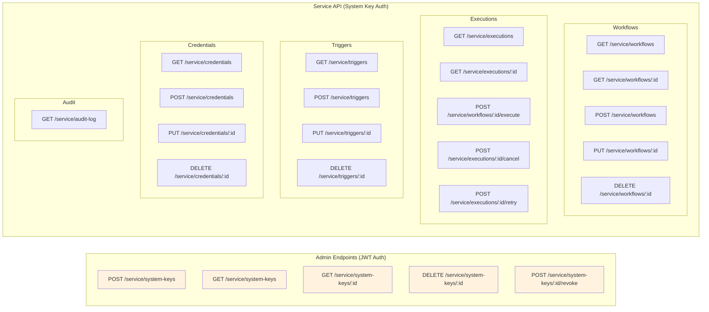

## SDK ServiceClient Architecture

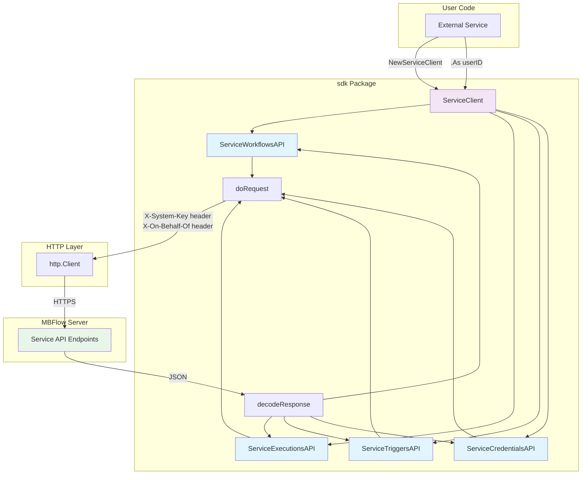

## System Key Lifecycle

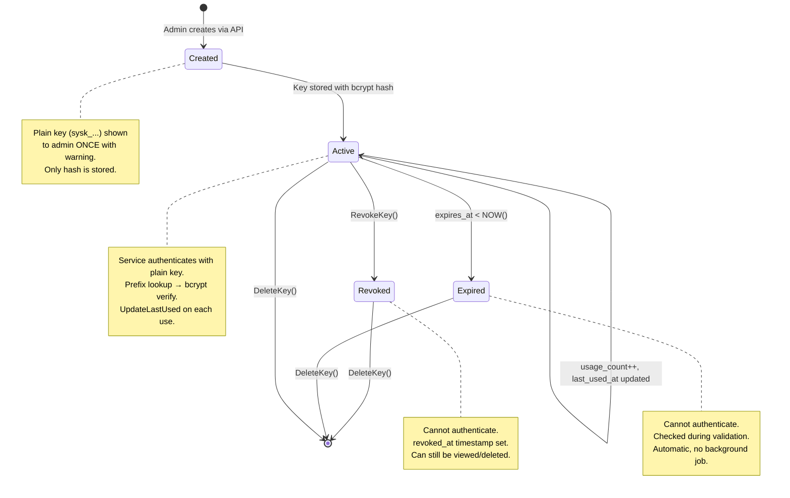

## Audit Log Body Sanitization

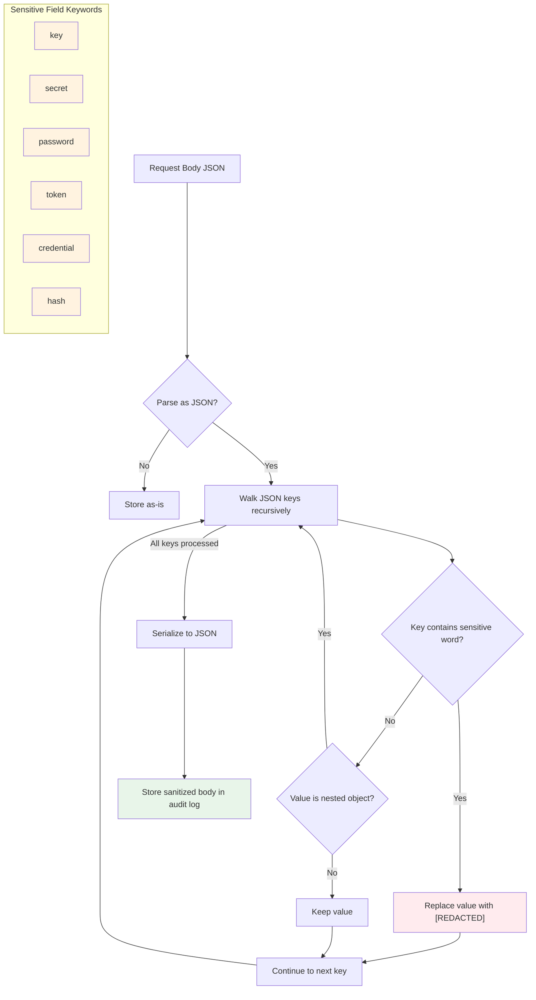

## Middleware Chain

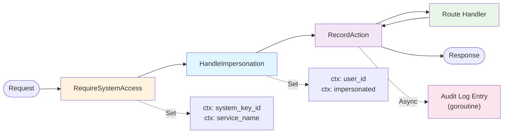

## Error Handling

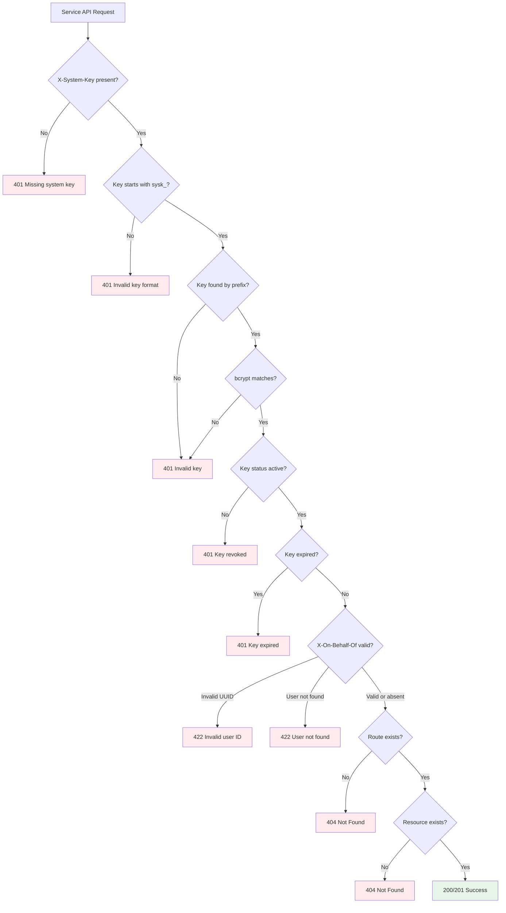

## Component Diagram

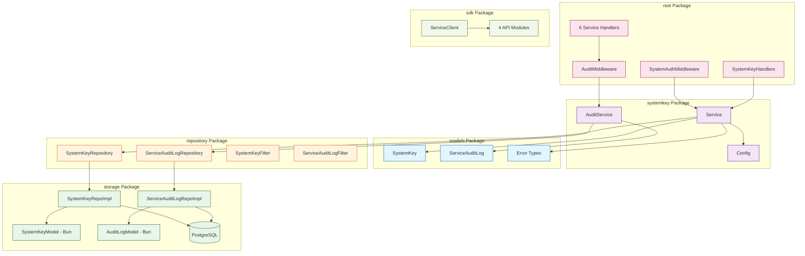

## Audit Log Retention

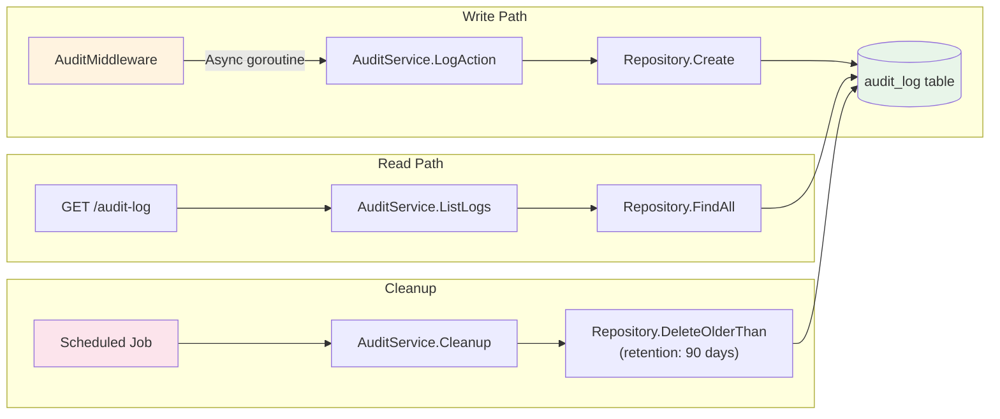

## Notes

- All diagrams use Mermaid syntax for rendering in GitHub/IDE
- System keys (`sysk_` prefix) are separate from service keys (`sk_` prefix)
- System keys provide full superadmin access, service keys provide user-scoped access
- Audit log body is sanitized before storage to prevent credential leakage
- Audit logging is async (goroutine) to avoid impacting request latency
- Impersonation allows services to act on behalf of specific users
- SDK provides `.As(userID)` for client-level and `OnBehalfOf(userID)` for per-call impersonation
