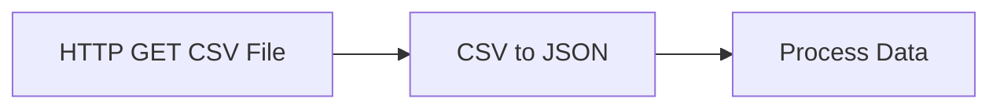

# CSV to JSON Executor

## Overview

The `csv_to_json` executor converts CSV (Comma-Separated Values) data into a JSON array of objects. Each row in the CSV becomes an object in the output array, with column headers used as keys.

**Type**: `csv_to_json`
**Category**: Adapter
**Backend**: `/backend/pkg/executor/builtin/csv_to_json.go`
**Frontend**: `/mbflow-react/components/nodes/config/CSVToJSONNodeConfig.tsx`

---

## Features

- **Flexible Delimiters**: Supports comma (`,`), semicolon (`;`), tab (`\t`), pipe (`|`), and any single character
- **Header Management**:
  - Auto-detect headers from first row
  - Use custom headers
  - Auto-generate column names (`col_0`, `col_1`, etc.)
- **Data Cleaning**:
  - Trim leading/trailing whitespace
  - Skip empty rows
- **Input Flexibility**: Accepts string, bytes, or map with auto-detection of common field names
- **Robust Parsing**: Handles quoted fields, newlines in quotes, and variable column counts

---

## Configuration

### Required Fields

None - all fields have sensible defaults.

### Optional Fields

| Field | Type | Default | Description |
|-------|------|---------|-------------|
| `delimiter` | string | `","` | Single character used to separate fields. Common: `,`, `;`, `\t`, `\|` |
| `has_header` | boolean | `true` | Whether the first row contains column headers |
| `custom_headers` | []string | `[]` | Custom column names to use (overrides `has_header`) |
| `trim_spaces` | boolean | `true` | Remove leading/trailing spaces from all values |
| `skip_empty_rows` | boolean | `true` | Skip rows where all fields are empty |
| `input_key` | string | `""` | If input is a map, extract CSV from this key. Auto-detects: `csv`, `data`, `content`, `body`, `text` |

---

## Input

The executor accepts CSV data in multiple formats:

### Direct String
```
"name,age,city\nJohn,30,NYC\nJane,25,LA"
```

### Bytes
```
[]byte("name,age,city\nJohn,30,NYC")
```

### Map with Auto-Detection
```json
{
  "csv": "name,age,city\nJohn,30,NYC",
  "metadata": { "source": "upload" }
}
```

The executor will automatically try these keys: `csv`, `data`, `content`, `body`, `text`.

### Map with Custom Key
```json
{
  "response": "name,age,city\nJohn,30,NYC"
}
```

With config: `{ "input_key": "response" }`

---

## Output

Returns a `CSVToJSONOutput` struct (auto-converted to `map[string]any`):

```json
{
  "success": true,
  "result": [
    {"name": "John", "age": "30", "city": "NYC"},
    {"name": "Jane", "age": "25", "city": "LA"}
  ],
  "row_count": 2,
  "column_count": 3,
  "headers": ["name", "age", "city"],
  "duration_ms": 5
}
```

### Output Fields

| Field | Type | Description |
|-------|------|-------------|
| `success` | boolean | Always `true` on successful execution |
| `result` | []map[string]any | Array of objects, one per CSV row |
| `row_count` | int | Number of data rows (excludes header if `has_header=true`) |
| `column_count` | int | Number of columns |
| `headers` | []string | Column headers used for keys |
| `duration_ms` | int64 | Execution time in milliseconds |

---

## Examples

### Example 1: Basic CSV with Headers

**Input**:
```csv
name,age,city
John,30,NYC
Jane,25,LA
```

**Config**:
```json
{
  "delimiter": ",",
  "has_header": true,
  "trim_spaces": true,
  "skip_empty_rows": true
}
```

**Output**:
```json
{
  "success": true,
  "result": [
    {"name": "John", "age": "30", "city": "NYC"},
    {"name": "Jane", "age": "25", "city": "LA"}
  ],
  "row_count": 2,
  "column_count": 3,
  "headers": ["name", "age", "city"],
  "duration_ms": 3
}
```

---

### Example 2: CSV Without Headers (Auto-Generated Column Names)

**Input**:
```csv
John,30,NYC
Jane,25,LA
```

**Config**:
```json
{
  "delimiter": ",",
  "has_header": false,
  "trim_spaces": true
}
```

**Output**:
```json
{
  "success": true,
  "result": [
    {"col_0": "John", "col_1": "30", "col_2": "NYC"},
    {"col_0": "Jane", "col_1": "25", "col_2": "LA"}
  ],
  "row_count": 2,
  "column_count": 3,
  "headers": ["col_0", "col_1", "col_2"],
  "duration_ms": 2
}
```

---

### Example 3: Custom Headers

**Input**:
```csv
John Doe,30,New York
Jane Smith,25,Los Angeles
```

**Config**:
```json
{
  "delimiter": ",",
  "has_header": false,
  "custom_headers": ["full_name", "years", "location"],
  "trim_spaces": true
}
```

**Output**:
```json
{
  "success": true,
  "result": [
    {"full_name": "John Doe", "years": "30", "location": "New York"},
    {"full_name": "Jane Smith", "years": "25", "location": "Los Angeles"}
  ],
  "row_count": 2,
  "column_count": 3,
  "headers": ["full_name", "years", "location"],
  "duration_ms": 2
}
```

---

### Example 4: Semicolon Delimiter

**Input**:
```csv
name;age;city
John;30;NYC
Jane;25;LA
```

**Config**:
```json
{
  "delimiter": ";",
  "has_header": true
}
```

**Output**:
```json
{
  "success": true,
  "result": [
    {"name": "John", "age": "30", "city": "NYC"},
    {"name": "Jane", "age": "25", "city": "LA"}
  ],
  "row_count": 2,
  "column_count": 3,
  "headers": ["name", "age", "city"],
  "duration_ms": 2
}
```

---

### Example 5: Tab-Delimited (TSV)

**Input**:
```
name	age	city
John	30	NYC
```

**Config**:
```json
{
  "delimiter": "\t",
  "has_header": true
}
```

**Output**:
```json
{
  "success": true,
  "result": [
    {"name": "John", "age": "30", "city": "NYC"}
  ],
  "row_count": 1,
  "column_count": 3,
  "headers": ["name", "age", "city"],
  "duration_ms": 1
}
```

---

### Example 6: CSV with Quoted Fields and Commas

**Input**:
```csv
name,bio
"John Doe","Software Engineer, Team Lead"
"Jane Smith","Data Scientist, ML Expert"
```

**Config**:
```json
{
  "delimiter": ",",
  "has_header": true,
  "trim_spaces": true
}
```

**Output**:
```json
{
  "success": true,
  "result": [
    {"name": "John Doe", "bio": "Software Engineer, Team Lead"},
    {"name": "Jane Smith", "bio": "Data Scientist, ML Expert"}
  ],
  "row_count": 2,
  "column_count": 2,
  "headers": ["name", "bio"],
  "duration_ms": 2
}
```

---

### Example 7: CSV from HTTP Response

**Workflow Diagram**:


**HTTP Node Output**:
```json
{
  "status": 200,
  "body": "name,age,city\nJohn,30,NYC\nJane,25,LA"
}
```

**CSV to JSON Config**:
```json
{
  "delimiter": ",",
  "has_header": true,
  "input_key": "body"
}
```

**CSV to JSON Output**:
```json
{
  "success": true,
  "result": [
    {"name": "John", "age": "30", "city": "NYC"},
    {"name": "Jane", "age": "25", "city": "LA"}
  ],
  "row_count": 2,
  "column_count": 3,
  "headers": ["name", "age", "city"],
  "duration_ms": 3
}
```

---

## Use Cases

### 1. Data Import Pipelines
Convert CSV files from external APIs or file uploads into JSON for processing:
```
HTTP Download → CSV to JSON → Transform → Database
```

### 2. Analytics Data Processing
Parse analytics exports (Google Analytics, CSV reports):
```
File Storage → CSV to JSON → Filter → Aggregate → Notification
```

### 3. ETL Workflows
Extract data from CSV sources:
```
CSV Input → CSV to JSON → Transform → HTTP API → Storage
```

### 4. Spreadsheet Integration
Process exported spreadsheets:
```
File Upload → CSV to JSON → Validation → Email Report
```

---

## Error Handling

### Common Errors

**Empty CSV**:
```
Error: "csv_to_json: input CSV content is empty"
```

**Invalid Delimiter**:
```
Error: "csv_to_json: delimiter must be a single character, got: ,,"
```

**Key Not Found** (when using `input_key`):
```
Error: "csv_to_json: key 'xyz' not found in input map"
```

**Invalid CSV Format**:
```
Error: "csv_to_json: failed to parse CSV: <parse error details>"
```

### Error Prevention Tips

1. **Always validate CSV source**: Check that input is not empty before parsing
2. **Use appropriate delimiter**: Match the delimiter to your data format
3. **Handle missing values**: Enable `skip_empty_rows` to ignore blank lines
4. **Trim spaces**: Enable `trim_spaces` for cleaner data
5. **Custom headers**: Use when CSV doesn't have headers or they need renaming

---

## Performance

- **Small files** (< 1000 rows): < 10ms
- **Medium files** (1000-10000 rows): < 100ms
- **Large files** (10000+ rows): < 1s

Tested with 1000-row CSV: ~5ms average execution time.

---

## Template Variable Usage

Access output in subsequent nodes:

```
{{input.result[0].name}}          # First row's name field
{{input.row_count}}               # Number of rows
{{input.headers[0]}}              # First column header
{{input.result}}                  # Full array of objects
```

### Example in Transform Node:
```javascript
// Filter rows where age > 25
input.result.filter(row => parseInt(row.age) > 25)
```

---

## Validation Rules

The executor validates:

1. **Delimiter**: Must be exactly 1 character
2. **Custom Headers**: Must be array of strings if provided
3. **Input**: Must be string, bytes, or map with valid content

Validation happens before execution. Invalid config will return an error immediately.

---

## Best Practices

1. **Always trim spaces**: Set `trim_spaces: true` for cleaner data
2. **Skip empty rows**: Set `skip_empty_rows: true` to avoid null objects
3. **Use custom headers for clarity**: Better than `col_0`, `col_1`, etc.
4. **Specify input_key for maps**: Explicit is better than auto-detection
5. **Handle variable columns**: The parser accepts different column counts per row

---

## Related Executors

- **string_to_json**: Parse JSON strings
- **bytes_to_json**: Decode bytes to JSON with encoding detection
- **json_to_string**: Serialize JSON back to string
- **transform**: Further process the resulting array with jq or JavaScript

---

## Testing

Comprehensive tests cover:
- ✅ Basic CSV with headers
- ✅ CSV without headers (auto-generated names)
- ✅ Custom headers
- ✅ Different delimiters (comma, semicolon, tab, pipe)
- ✅ Empty rows (skip enabled/disabled)
- ✅ Quoted fields with commas
- ✅ Leading/trailing spaces (trim enabled/disabled)
- ✅ Variable column counts
- ✅ Bytes and map inputs
- ✅ Custom input_key
- ✅ Edge cases (empty CSV, only headers, newlines in quotes)
- ✅ Performance (1000 rows)

Run tests:
```bash
cd backend
go test -v ./pkg/executor/builtin/... -run TestCSVToJSON
```

---

## Implementation Notes

- Uses Go's standard `encoding/csv` package
- Lazy quotes enabled for lenient parsing
- Accepts variable fields per record
- All values are strings (no type inference)
- Headers trimmed when `trim_spaces: true`
- Struct output auto-converted to map by engine

---

## Version History

- **v1.0** (2025-12-15): Initial implementation
  - Basic CSV parsing
  - Custom headers support
  - Multiple delimiter support
  - Comprehensive validation and testing
