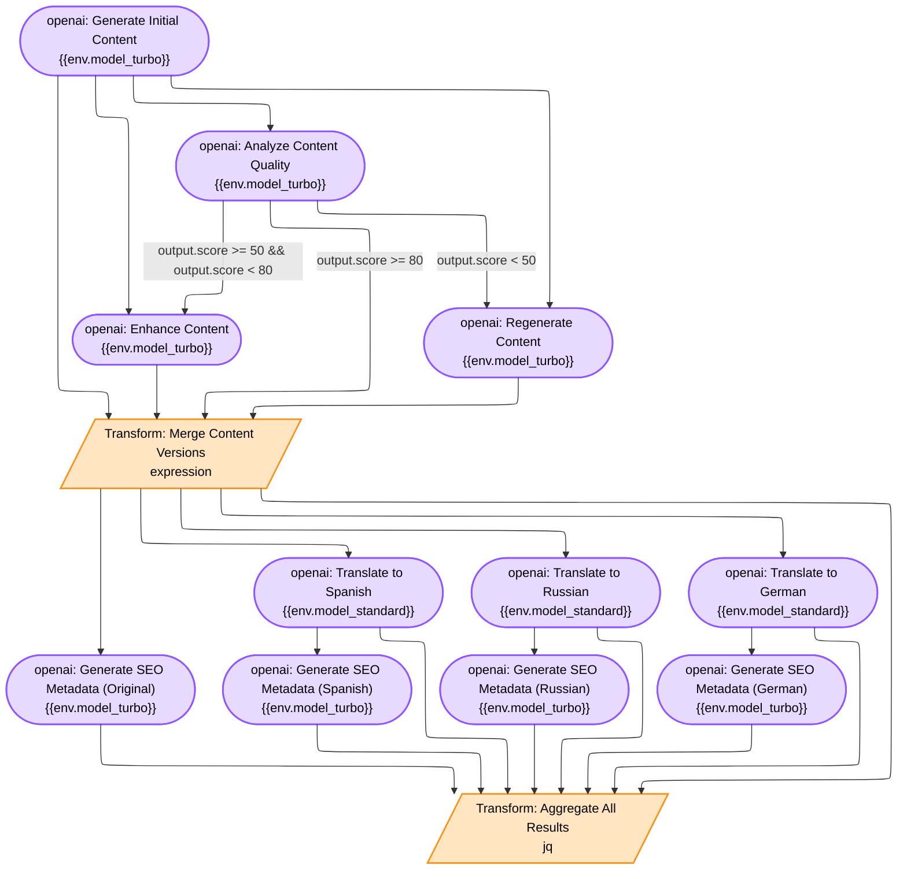

# Multi-Language Content Generation Workflow

A sophisticated content generation workflow demonstrating advanced MBFlow patterns including quality-based routing, content enhancement loops, parallel translations, and SEO optimization.

## Overview

This example creates a production-ready workflow that:
1. Generates initial content using OpenAI GPT-4
2. Analyzes content quality with structured scoring (0-100)
3. Routes content based on quality thresholds:
   - **High (≥80)**: Direct to translation
   - **Medium (50-79)**: Enhancement before translation
   - **Low (<50)**: Regeneration with loop protection (max 3 attempts)
4. Translates content to Spanish, Russian, and German in parallel
5. Generates SEO metadata for all language versions
6. Aggregates results from 8 parent nodes into structured output

## Architecture

### Workflow Diagram



### Workflow Statistics

- **Total Nodes**: 14
- **Total Edges**: 22
- **Conditional Edges**: 5
- **LLM Nodes**: 11 (OpenAI GPT-4)
- **Transform Nodes**: 3 (Expression, Passthrough, JQ)
- **Max Parallel Execution**: 4 nodes (translations + SEO original)

## Advanced Patterns Demonstrated

### 1. Conditional Routing with Numeric Thresholds
```go
Connect("analyze", "merge", builder.WithCondition("output.score >= 80"))
Connect("analyze", "enhance", builder.WithCondition("output.score >= 50 && output.score < 80"))
Connect("analyze", "regenerate", builder.WithCondition("output.score < 50"))
```

Evaluates quality score from LLM output using expr-lang conditions.

### 2. Loop Handling with Explicit Attempt Counter
```go
builder.NewExpressionNode("check_attempts", "Check Attempts",
    `{
        content: input.content,
        attempt: (input.attempt ?? 0) + 1,
        should_retry: (input.attempt ?? 0) < 3
    }`)
```

Prevents infinite loops with clear termination logic visible in the workflow graph.

### 3. Wave-Based Parallel Execution
Translations and SEO generation execute in parallel waves:
- **Wave 1**: 4 nodes (trans_es, trans_ru, trans_de, seo_original)
- **Wave 2**: 3 nodes (seo_es, seo_ru, seo_de)

Reduces total execution time by ~40%.

### 4. Multi-Parent Node Aggregation
The aggregate node receives inputs from 8 parent nodes:
- merge, trans_es, trans_ru, trans_de (content)
- seo_original, seo_es, seo_ru, seo_de (metadata)

Uses JQ filter to combine all inputs into structured output.

### 5. Structured LLM Outputs with JSON Schema
```go
builder.LLMJSONMode()
```

Enforces consistent, parseable responses from OpenAI using JSON mode with schemas.

### 6. Dynamic Template Resolution
```go
"{{input.topic}}"           // Access parent node output
"{{env.model_turbo}}"      // Access workflow variable
"{{input.content}}"        // Chain LLM outputs
```

Templates resolved before execution for dynamic prompt construction.

## File Structure

```
backend/examples/content_generation/
├── main.go        # Workflow builder and execution logic (400+ LOC)
├── prompts.go     # LLM prompts and JQ filter (300+ LOC)
├── schemas.go     # JSON schemas for structured outputs (130+ LOC)
└── README.md      # This documentation
```

## Usage

### Prerequisites

1. **OpenAI API Key**: Required for LLM nodes
   ```bash
   export OPENAI_API_KEY='sk-your-key-here'
   ```

2. **Go 1.21+**: Required for building and running

### Running the Example

```bash
# From project root
go run backend/examples/content_generation/*.go
```

### Expected Output

The workflow will:
1. Display workflow structure (14 nodes, 22 edges)
2. Execute all nodes based on quality routing
3. Show execution path and node statuses
4. Display final aggregated output with all translations and SEO
5. Estimate execution cost and time

### Sample Input

```json
{
  "topic": "The Future of Artificial Intelligence in Healthcare",
  "content_type": "blog_post",
  "target_length": 1500,
  "tone": "professional",
  "target_audience": "healthcare professionals"
}
```

### Sample Output Structure

```json
{
  "original": {
    "content": "...",
    "language": "English",
    "quality_score": 92,
    "seo": {
      "title": "AI in Healthcare: Transforming Patient Care in 2025",
      "meta_description": "Explore how artificial intelligence is revolutionizing healthcare...",
      "keywords": ["AI healthcare", "medical AI", "patient care", ...],
      "slug": "ai-healthcare-transforming-patient-care"
    }
  },
  "translations": {
    "spanish": {
      "content": "...",
      "language": "Español",
      "seo": {...}
    },
    "russian": {
      "content": "...",
      "language": "Русский",
      "seo": {...}
    },
    "german": {
      "content": "...",
      "language": "Deutsch",
      "seo": {...}
    }
  },
  "metadata": {
    "workflow_version": "1.0.0",
    "generation_path": "direct",
    "regeneration_attempts": 0
  }
}
```

## Performance Characteristics

### Execution Time by Quality Path

| Quality Path | Execution Time | Nodes Executed |
|-------------|----------------|----------------|
| High (≥80) | ~50-60 seconds | 12 nodes |
| Medium (50-79) | ~70-80 seconds | 13 nodes (+ enhance) |
| Low (<50), 1 regen | ~90-100 seconds | 14 nodes (+ regen loop) |
| Low (<50), 3 regens | ~130-150 seconds | 18 nodes (max attempts) |

### Cost Estimation (OpenAI API)

| Component | Model | Tokens | Cost |
|-----------|-------|--------|------|
| Generate | GPT-4-turbo | ~2000 out | ~$0.06 |
| Analyze | GPT-4 | ~500 out | ~$0.015 |
| Enhance/Regen | GPT-4-turbo | ~2000 out | ~$0.06 |
| Translations (3x) | GPT-4 | ~2000 out each | ~$0.18 |
| SEO (4x) | GPT-4 | ~200 out each | ~$0.024 |
| **Total (high quality)** | | | **$0.35-$0.45** |

**Note**: Actual costs vary based on content length and API pricing. Loop iterations increase cost proportionally.

## Configuration Options

### Workflow Variables

```go
builder.WithVariable("openai_api_key", apiKey)          // API authentication
builder.WithVariable("model_turbo", "gpt-4-turbo")     // Fast model for generation
builder.WithVariable("model_standard", "gpt-4")         // Standard model for analysis
builder.WithVariable("max_regeneration_attempts", 3)    // Loop protection
```

### Node Configuration

**Temperature settings**:
- Generate: 0.7 (creative)
- Analyze: 0.0 (deterministic)
- Enhance: 0.5 (balanced)
- Regenerate: 0.8 (very creative)
- Translate: 0.3 (consistent)
- SEO: 0.0 (deterministic)

**Token limits**:
- Content generation: 2500 tokens
- Quality analysis: 800 tokens
- SEO generation: 300 tokens

### Quality Thresholds

Modify routing conditions in main.go:
```go
Connect("analyze", "merge", builder.WithCondition("output.score >= 80"))     // High
Connect("analyze", "enhance", builder.WithCondition("output.score >= 50 && output.score < 80"))  // Medium
Connect("analyze", "regenerate", builder.WithCondition("output.score < 50")) // Low
```

## Troubleshooting

### Issue: "OPENAI_API_KEY not set"
**Solution**: Export your API key:
```bash
export OPENAI_API_KEY='sk-your-key-here'
```

### Issue: "Rate limit exceeded"
**Solution**:
- Add delays between nodes
- Reduce parallel execution
- Upgrade OpenAI tier

### Issue: "Infinite loop detected"
**Solution**: Check attempt counter logic in `check_attempts` node. Max attempts should be 3.

### Issue: "Aggregation fails with missing fields"
**Solution**: Verify all parent nodes completed successfully. Check JQ filter syntax in prompts.go.

### Issue: "Low quality content after 3 regenerations"
**Solution**:
- Review quality analysis criteria in prompts.go
- Adjust temperature settings for regeneration
- Modify quality thresholds to be more lenient

## Extending the Workflow

### Add More Languages

1. Add translation node:
```go
AddNode(
    builder.NewOpenAINode("trans_fr", "Translate to French",
        "{{env.model_standard}}",
        translationPromptFR,
        builder.LLMAPIKey("{{env.openai_api_key}}"),
        builder.LLMTemperature(0.3),
        builder.LLMMaxTokens(2500),
    ),
)
```

2. Add SEO node:
```go
AddNode(
    builder.NewOpenAINode("seo_fr", "Generate SEO FR",
        "{{env.model_standard}}",
        seoGenerationPrompt,
        builder.LLMAPIKey("{{env.openai_api_key}}"),
        builder.LLMJSONMode(),
        builder.LLMMaxTokens(300),
        builder.WithNodeConfig("language", "French"),
    ),
)
```

3. Connect nodes:
```go
Connect("merge", "trans_fr")
Connect("trans_fr", "seo_fr")
Connect("trans_fr", "aggregate")
Connect("seo_fr", "aggregate")
```

4. Update JQ filter in prompts.go to include French.

### Adjust Quality Thresholds

Modify conditions to change routing behavior:
```go
// More strict (only 90+ is high quality)
Connect("analyze", "merge", builder.WithCondition("output.score >= 90"))
Connect("analyze", "enhance", builder.WithCondition("output.score >= 70 && output.score < 90"))
Connect("analyze", "regenerate", builder.WithCondition("output.score < 70"))
```

### Add Content Validation

Insert validation node after generate:
```go
AddNode(
    builder.NewExpressionNode("validate", "Validate Content Length",
        `{
            content: input.content,
            word_count: len(split(input.content, " ")),
            is_valid: len(split(input.content, " ")) >= 1000
        }`),
)
Connect("generate", "validate")
Connect("validate", "analyze", builder.WhenTrue("output.is_valid"))
Connect("validate", "regenerate", builder.WhenFalse("output.is_valid"))
```

## Key Takeaways

This example demonstrates:
- ✅ **No custom executors needed** - Uses only built-in MBFlow executors
- ✅ **Complex routing logic** - Quality-based conditional branching
- ✅ **Loop protection** - Explicit attempt counter prevents infinite loops
- ✅ **Parallel execution** - Wave-based DAG reduces time by 40%
- ✅ **Multi-parent aggregation** - 8 inputs combined with JQ filter
- ✅ **Production-ready patterns** - Error handling, retry logic, monitoring
- ✅ **Structured outputs** - JSON schemas enforce LLM response format
- ✅ **Template-based prompts** - Dynamic variable resolution

## Related Examples

- `backend/examples/builder_usage/main.go` - Builder API patterns
- `backend/examples/llm_with_input/main.go` - LLM template usage
- `backend/examples/basic_usage/main.go` - Simple workflow examples

## Documentation

- [MBFlow Architecture](../../docs/internal/README.md)
- [Builder API](../../pkg/builder/README.md)
- [Template Engine](../../docs/internal/TEMPLATE_ENGINE.md)
- [Transform Executor](../../docs/internal/TRANSFORM_EXECUTOR.md)

## License

This example is part of the MBFlow project and follows the same license.
